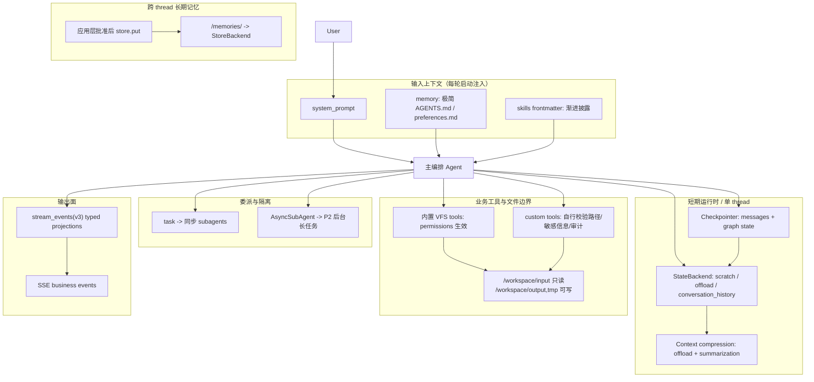
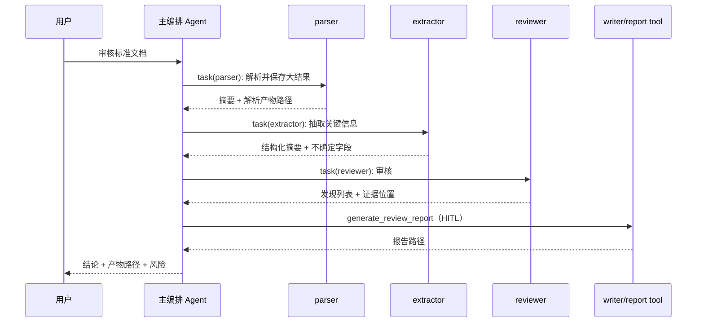
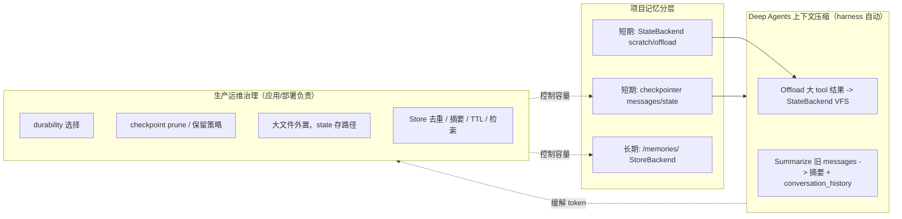

# 标准文档助手 Context Engineering 完善方案 V2

> 依据：官方 Deep Agents / LangChain 文档（MCP 与官方文档核对）+ 项目 `agent.py` / `tools.py` / `streaming.py` / `skills/` / `memories/` / `AGENTS.md` / `tools.json` / `config.yaml` / `design_docs/long_memory-exploded.md`。
> **本文是下一轮代码修改的实施参考文档，不直接实施代码。**

---

## 一、总览：实施基线与官方依据映射表

### 1.1 版本与能力基线

后续代码修改必须先把依赖能力固定下来，避免 SPEC 依赖的 Deep Agents 能力在重新安装或部署时不可用。

| 能力 | 最低建议版本 | 原因 | 验收方式 |
|------|--------------|------|----------|
| Deep Agents harness / permissions / async subagents / v3 event streaming | `deepagents>=0.6.x` | 当前本地为 `0.6.6`；SPEC 依赖新版 streaming projections 与权限能力 | `python -m pip show deepagents` 输出版本满足要求 |
| LangGraph v3 event streaming / durable execution / Agent Protocol 运行基础 | `langgraph>=1.2.x` | 当前本地为 `1.2.2`；v3 event streaming 与 async subagents 依赖新版运行时 | `python -m pip show langgraph` 输出版本满足要求 |
| LangChain typed event streaming | `langchain>=1.3.x,<2.0` | 当前本地为 `1.3.2`；文档建议使用 `stream_events(..., version="v3")` | `python -m pip show langchain` 输出版本满足要求 |

**后续代码落点：** `pyproject.toml` 应把裸写的 `deepagents` 改为带下限版本；`langgraph`、`langchain` 的下限应与本文一致。

### 1.2 总览映射表

| 完善主题 | 官方依据（必读） | 当前项目状态 | 实施优先级 |
|---------|----------------|-------------|-----------|
| Memory：长期与短期 | [Memory](https://docs.langchain.com/oss/python/deepagents/memory) · [Context engineering](https://docs.langchain.com/oss/python/deepagents/context-engineering) · [Backends](https://docs.langchain.com/oss/python/deepagents/backends) | `StoreBackend` + `seed_memory_store`；本地 `InMemoryStore` / `MemorySaver` | P0 生产 Store/Checkpointer；P1 去重/摘要/检索 |
| Skills 渐进披露 | [Skills](https://docs.langchain.com/oss/python/deepagents/skills) · [Context engineering](https://docs.langchain.com/oss/python/deepagents/context-engineering) | 3 个 workflow skill；子代理绑定 skill | P1 参考文件化；P2 interpreter skills |
| Tools / Middleware / HITL | [Customization](https://docs.langchain.com/oss/python/deepagents/customization) · [Human-in-the-loop](https://docs.langchain.com/oss/python/deepagents/human-in-the-loop) · [Permissions](https://docs.langchain.com/oss/python/deepagents/permissions) | 8 个业务 tool；`interrupt_on` 已配；`tools.json` 不完全同步 | P0 对齐 `tools.json` 与 `agent.py`；P0 custom tools 自行做安全边界 |
| 同步子智能体 | [Subagents](https://docs.langchain.com/oss/python/deepagents/subagents) | 6 个 dict subagent；适合当前顺序链路 | P0 保持主路径；P1 统一返回格式 |
| Async 子智能体 | [Async subagents](https://docs.langchain.com/oss/python/deepagents/async-subagents) | 未使用；当前任务以单文档顺序处理为主 | P2 仅用于多文件/长耗时后台任务 |
| VFS / Backend / Permissions | [Backends](https://docs.langchain.com/oss/python/deepagents/backends) · [Permissions](https://docs.langchain.com/oss/python/deepagents/permissions) | `CompositeBackend` 三分离已落地 | P0 保持；P0 补 custom tools 路径校验 |
| Sandbox | [Sandboxes](https://docs.langchain.com/oss/python/deepagents/sandboxes) | 未接入；仅注释提及 pandoc/LibreOffice | P2 默认；若引入 shell/外部转换/不可信文档处理则上调到 P0/P1 |
| 上下文压缩 vs Checkpoint 治理 | [Context engineering](https://docs.langchain.com/oss/python/deepagents/context-engineering) + `long_memory-exploded.md` | 依赖 Deep Agents 内置 offload/summarization；本地持久化不足 | P0 概念分层；P1 生产持久化与 prune 策略 |
| 流式输出 | [Deep Agents event-streaming](https://docs.langchain.com/oss/python/deepagents/event-streaming) · [LangChain event-streaming](https://docs.langchain.com/oss/python/langchain/event-streaming) | `astream(stream_mode="updates")` 旧路径 | P0 迁移 v3 typed projections；保留 v2 fallback |
| Interpreters / Profiles | [Interpreters](https://docs.langchain.com/oss/python/deepagents/interpreters) · [Profiles](https://docs.langchain.com/oss/python/deepagents/profiles) | 未使用；Qwen 无自定义 profile | P2 按需 |



---

## 二、逐题完善

---

### 1. Memory 设计

#### 官方说明摘要

- **短期记忆**：同一 `thread_id` 内的会话历史、graph state、scratch 文件和 Deep Agents offload 文件，由 `checkpointer + StateBackend` 管理。
- **长期记忆**：跨 thread / 跨会话持久化的信息，通过 `CompositeBackend` 将 `/memories/` 路由到 `StoreBackend`。
- **Memory 注入原则**：`memory=` 配置的文件会进入启动上下文，不具备 skills 的 progressive disclosure，因此必须极简。
- **Skills vs Memory**：常驻规则、用户偏好、项目约束放 memory；详细流程、审核规则、模板说明放 skills 或 references。

#### 当前项目现状

| 项 | 实现 |
|----|------|
| 启动加载 | `memory=["/memories/AGENTS.md", "/memories/preferences.md"]` |
| 种子文件 | `seed_memory_store` 将 `AGENTS.md`、`preferences.md`、`project-notes.md` 写入 Store |
| 后端 | `CompositeBackend(default=StateBackend(), routes={"/memories/": StoreBackend(...), "/workspace/": FilesystemBackend(...)})` |
| 命名空间 | 本地 `MEMORY_NAMESPACE`；LangGraph Server 时按 `assistant_id` / `user.identity` 区分 |
| 写入策略 | `permissions` 拒绝内置 VFS 对 `/memories/**` 的写入；业务侧 `propose_memory_update` 只生成提案 |
| 本地持久化 | `InMemoryStore` + `MemorySaver`，仅适合演示和测试 |

#### 实施要求

| 优先级 | 要求 | 代码落点 | 验收方式 |
|--------|------|----------|----------|
| **P0** | 生产 Store 改为 Postgres/Redis/平台 Store，不使用 `InMemoryStore` 承载长期记忆 | `config.yaml`、`agent.py` | 重启进程后 `/memories/` 仍可读取已批准记忆 |
| **P0** | 生产 Checkpointer 改为持久 checkpointer，HITL 和多轮 thread 不依赖 `MemorySaver` | `config.yaml`、部署配置、`agent.py` | 中断审批后可用同一 `thread_id` 恢复 |
| **P0** | 明确长期记忆写入热路径：`propose_memory_update` -> HITL -> 应用层校验 -> `store.put` | `tools.py`、API 层、`agent.py` | Agent 不能直接写 `/memories/**`；批准后才产生 Store 写入 |
| **P0** | `memory=` 保持极简，不加载标准全文、长解析结果、批量审核日志 | `agent.py`、`memories/*.md` | 启动 memory 文件只包含常驻规则和偏好 |
| **P1** | 对长期记忆写入做去重、摘要、敏感信息过滤 | API 层、memory service | 重复偏好不重复写；secret/隐私拒绝写入 |
| **P1** | `project-notes.md` 不默认进 `memory=`；若内容增长，改为 skill/reference 或 Store 按需检索 | `agent.py`、`skills/`、`memories/` | 项目路径约定仍可被工具/skill 获取，但不膨胀启动 prompt |
| **P2** | 背景 consolidation、TTL、冷热分离和 RAG 检索 | memory service、定时任务 | 长期运行后 Store 大小可控 |

#### 关键边界

- `StoreBackend` 需要 `store=` 实例；生产不可只配置 backend 而不配置持久 Store。
- `/memories/` 是长期记忆命名空间，不是标准正文库。标准正文、解析中间结果、审核报告应写入 `/workspace/output` 或对象存储，并只在 state 中保存路径或摘要。
- `permissions` 只约束内置 VFS 工具，不约束 custom tools；因此记忆写入提案和批准后的 Store 写入必须在应用层校验。

#### 是否建议采用及理由

**建议采用，并作为 P0 生产化工作。** 标准文档助手的长期记忆只应保存长期偏好、项目规则和经过确认的事实；短期上下文由 thread state 和 StateBackend 管理，避免把大文档内容误放入长期记忆。

---

### 2. Skills 设计

#### 官方说明摘要

- Skills 是 procedural memory：目录 + `SKILL.md` frontmatter + 说明文件/脚本/模板。
- Deep Agents 启动时只读取 `SKILL.md` frontmatter；任务匹配后再读取全文，属于 progressive disclosure。
- 子代理的 custom skills 需要显式配置；不要假设所有 custom subagent 都继承主 Agent skills。

#### 当前项目现状

- 主 Agent：`skills=[str(SKILLS_DIR)]`。
- 子代理：
  - `extractor` -> `standard-extraction`
  - `reviewer` -> `standard-review`
  - `writer` -> `standard-drafting`
- `subagents/*/AGENTS.md` 与 `skills/*/SKILL.md` 有一定重复。

#### 实施要求

| 优先级 | 要求 | 代码/文档落点 | 验收方式 |
|--------|------|---------------|----------|
| **P0** | 保持“一 skill 一工作流”：抽取、审核、起草分别独立 | `skills/standard-*` | 每个 skill 的 description 能明确触发场景 |
| **P1** | 将详细规则、模板字段、示例迁移到 `references/`，并在 `SKILL.md` 中说明何时读取 | `skills/*/references/` | `SKILL.md` 主体简洁，引用文件可按需读取 |
| **P1** | `subagents/*/AGENTS.md` 只保留角色边界，流程细节以 skill 为准 | `subagents/*/AGENTS.md`、`skills/*/SKILL.md` | 同一规则不在两个位置重复维护 |
| **P2** | 确定性校验脚本可考虑 interpreter skills 或普通业务 tools | `skills/*/scripts/`、`tools.py` | 脚本有明确输入输出和测试 |

#### 是否建议采用及理由

**强烈建议。** 标准审核、标准起草和信息抽取是典型流程型知识，适合放入 Skills，而不是放入 memory 或主 prompt。

---

### 3. Tools / Middleware / HITL

#### 官方说明摘要

Deep Agents 内置工具包括：

| 类别 | 工具 |
|------|------|
| 规划 | `write_todos` |
| VFS | `ls`, `read_file`, `write_file`, `edit_file`, `glob`, `grep` |
| 子代理 | `task` |
| Sandbox | `execute`（仅 sandbox/backend 暴露时可用） |

Custom tools 通过 `tools=[...]` 暴露给 Agent。HITL 通过 `interrupt_on` 配置，必须配合 checkpointer，并用同一 `thread_id` resume。

#### 当前项目现状

业务 tools：

`parse_document`, `convert_document_format`, `extract_key_information`, `search_reference_documents`, `generate_review_report`, `generate_standard_draft`, `validate_output_schema`, `propose_memory_update`

当前 `agent.py` 的 `interrupt_on` 包含：

```python
{
    "write_file": True,
    "edit_file": True,
    "convert_document_format": True,
    "search_reference_documents": True,
    "generate_review_report": True,
    "generate_standard_draft": True,
    "propose_memory_update": True,
    "execute": True,
}
```

当前 `tools.json` 只列出业务 tools，且 `interrupt_config` 缺 `write_file` / `edit_file` / `execute`。

#### P0 安全边界：custom tools 不受 permissions 保护

官方 permissions 只作用于内置 VFS 工具：

`ls`, `read_file`, `glob`, `grep`, `write_file`, `edit_file`

**不覆盖：**

- `parse_document`
- `convert_document_format`
- `search_reference_documents`
- `generate_review_report`
- `generate_standard_draft`
- `validate_output_schema`
- `propose_memory_update`
- MCP tools
- sandbox `execute`

因此业务工具必须自行实现边界校验，不得依赖 `permissions`。

#### 实施要求

| 优先级 | 要求 | 代码落点 | 验收方式 |
|--------|------|----------|----------|
| **P0** | `tools.json` 与 `agent.py interrupt_on` 完全对齐，并记录内置工具中断策略 | `tools.json`、`agent.py` | 两处工具名和审批策略一致 |
| **P0** | `parse_document` 必须限制读取边界：默认只允许 `/workspace/input`、`/workspace/templates` 或显式白名单 | `tools.py` | 传入任意绝对路径、项目外路径、secret 路径时被拒绝 |
| **P0** | 写入类工具只能写 `/workspace/output` 或 `/workspace/tmp`，禁止覆盖原始输入 | `tools.py` | `generate_*`、`convert_document_format` 无法写入 input/templates/项目根 |
| **P0** | custom tools 自行做敏感路径、secret 文件名、扩展名、输出目录、审计日志校验 | `tools.py`、API 层 | 单元测试覆盖 `.env`、`secret`、`credential`、路径穿越 |
| **P0** | 写入、转换、外部检索、记忆更新、sandbox/execute 必须 HITL | `agent.py`、`streaming.py`、API 层 | 调用这些工具前出现 `approval.required` |
| **P1** | 细化 `allowed_decisions` | `agent.py` | 只读检索 `approve/reject`；写报告/草稿 `approve/edit/reject`；记忆提案 `approve/reject/respond` |
| **P1** | 工具 docstring 增加“何时使用”和参数约束 | `tools.py` | 模型可从 tool prompt 判断使用场景 |

#### HITL resume schema

后续 API/SSE 层应支持完整决策，而不是只支持 `approve/reject`。

```json
{
  "thread_id": "standard-doc-...",
  "run_id": "run_...",
  "decision": {
    "type": "approve | reject | edit | respond",
    "message": "可选：拒绝或人工回复说明",
    "edited_action": {
      "name": "generate_review_report",
      "args": {}
    }
  }
}
```

执行要求：

- resume 必须使用触发 interrupt 时的同一 `thread_id`。
- 多个 pending tool call 时，决策顺序必须与 pending actions 顺序一致。
- `edit` 只能修改工具参数，不能绕过工具自身的路径/敏感信息校验。
- `respond` 用于把人工回复作为 tool result，不应执行原工具。

#### 是否建议采用及理由

**必须采用。** 标准文档助手会读取用户文档、生成报告、转换格式、保存记忆，这些都是高风险边界。HITL 只解决“执行前审批”，custom tools 仍必须在代码层做确定性安全校验。

---

### 4. 子智能体（同步 + 异步）

#### 官方说明摘要

同步 subagents 通过内置 `task` 工具委派，主 Agent 阻塞等待结果。优势是 context isolation：子代理的中间工具调用和大输出不会污染主 Agent 上下文，主 Agent 只接收最终报告。

Async subagents 是 preview 能力，适合长时、可并行、需要中途 steering/cancel 的后台任务；依赖 Agent Protocol 与部署拓扑。

#### 当前项目现状

6 个同步子代理：

`parser`, `extractor`, `reviewer`, `research`, `writer`, `vision_parser`

均在 `build_subagents()` 中以 dict 定义。`subagents/*/AGENTS.md` 存在，但不是当前 SDK 运行时的唯一来源。

#### 同步子代理实施要求

| 优先级 | 要求 | 代码落点 | 验收方式 |
|--------|------|----------|----------|
| **P0** | 同步 subagents 仍为默认主路径 | `agent.py`、`prompts.py` | 单文档审核链路按 parser -> extractor -> reviewer -> report 执行 |
| **P0** | 主 Agent 只负责编排、汇总、审批和最终回复，不粘贴大段解析正文 | `prompts.py`、`AGENTS.md` | 大文本结果以路径/摘要返回 |
| **P1** | 所有 subagent prompt 统一返回格式：结论、产物路径、关键发现、风险、下一步 | `prompts.py`、`subagents/*/AGENTS.md` | 主 Agent 收到可稳定汇总的结构 |
| **P1** | 子代理工具集合最小化，避免 reviewer 拿到不必要的写入/转换工具 | `agent.py build_subagents()` | 每个子代理只暴露完成任务所需工具 |
| **P1** | `vision_parser` 如实际启用，需配置 vision 模型或 OCR 工具；否则明确返回能力边界 | `config.yaml`、`agent.py`、`tools.py` | 扫描件输入不会被误判为已完整解析 |

#### Async 子智能体采用条件

Async subagents **不作为下一轮 P0 修改目标**。只有满足以下场景才进入 P2 实施：

- 多文件批量审核，单个子任务可独立完成。
- 长耗时参考检索，需要用户中途追加方向。
- OCR、LibreOffice/pandoc 转换、复杂格式检查等后台任务。
- 用户需要取消、继续询问、查看进度，而主 Agent 不能阻塞等待。

若采用 async，必须先定义：

| 项 | 必填要求 |
|----|----------|
| `task_id` | 启动 async 后立即返回，可用于查询和取消 |
| 状态 | `queued` / `running` / `completed` / `failed` / `cancelled` |
| 产物路径 | 每个后台任务必须写入 `/workspace/output` 或 `/workspace/tmp`，最终返回路径 |
| 错误恢复 | 失败要返回可重试原因、日志路径、是否可部分采用 |
| 取消语义 | cancel 后不得留下半覆盖文件；中间文件放 tmp |
| `thread_id` | supervisor 与 worker trace 必须关联 |
| 部署拓扑 | ASGI co-deployed / HTTP remote / LangSmith Deployment 三选一 |

#### Deep Agents Code 子代理说明

Deep Agents Code 的 `subagents/*/AGENTS.md` frontmatter 只适合配置 name/description/model 等有限字段；tools、middleware、interrupt、skills 等完整控制仍应以 SDK dict 或 `CompiledSubAgent` 为准。因此本项目下一轮实现以 `agent.py build_subagents()` 作为运行时单一来源，`subagents/*/AGENTS.md` 作为文档化角色说明。

#### 是否建议采用及理由

**同步子代理继续采用，async 暂缓。** 标准文档助手的核心流程天然有顺序依赖：解析后才能抽取，抽取后才能审核，审核后才能报告。async 的收益主要在批量和长耗时后台任务。



---

### 5. VFS、Backend、Permissions、Sandbox

#### 官方说明摘要

- Deep Agents 通过 VFS 工具暴露统一路径：`ls`、`read_file`、`write_file`、`edit_file`、`glob`、`grep`。
- `StateBackend` 是 thread-scoped，适合 scratch、offload 和 conversation history。
- `StoreBackend` 适合跨 thread 长期记忆。
- `FilesystemBackend(root_dir=..., virtual_mode=True)` 适合本地开发或受限 workspace。
- `CompositeBackend` 负责按路径前缀路由。
- `permissions` 只保护内置 VFS 工具，不保护 custom tools、MCP tools 或 sandbox `execute`。
- sandbox backend 会额外暴露 `execute`，用于隔离执行外部命令或不可信代码。

#### 当前项目现状

```text
CompositeBackend(
  default=StateBackend(),
  routes={
    "/memories/": StoreBackend(namespace=...),
    "/workspace/": FilesystemBackend(root_dir=workspace, virtual_mode=True),
  }
)
```

Permissions 当前意图：

- 拒绝 `.env` / secret 类文件。
- `/workspace/input/`、`/workspace/templates/` 只读。
- `/workspace/output/`、`/workspace/tmp/` 可写。
- `/memories/` 只读。

#### 实施要求

| 优先级 | 要求 | 代码落点 | 验收方式 |
|--------|------|----------|----------|
| **P0** | 保持 `StateBackend + StoreBackend + FilesystemBackend(virtual_mode=True)` 三分离 | `agent.py build_backend()` | `/memories/`、`/workspace/`、scratch 路由互不混淆 |
| **P0** | `permissions` 继续保护内置 VFS 工具 | `agent.py build_permissions()` | 内置 `write_file` 无法写 input/templates/memories |
| **P0** | custom tools 复刻同等路径策略 | `tools.py` | custom tool 无法绕过 permissions 写入或读取受限路径 |
| **P1** | 文档化路径约定：input 原始文件只读；output 最终产物；tmp 中间产物；memories 长期规则 | `README.md`、`memories/project-notes.md`、`AGENTS.md` | 用户和 Agent 输出路径一致 |
| **P1** | 大工具结果写文件并返回路径，不把全文返回主 Agent | `tools.py`、subagent prompt | 大文档解析不会把完整正文塞回主上下文 |
| **P2** | sandbox 用于 LibreOffice、pandoc、pytest、OCR 或外部命令 | `agent.py`、部署配置、`config.yaml` | 外部命令在隔离环境中运行 |

#### Sandbox 升级规则

Sandbox 默认 P2，但出现以下任一条件必须上调：

- 引入 LibreOffice、pandoc、shell、Python 脚本执行、OCR CLI。
- 处理不可信文档并需要执行转换工具。
- 允许 Agent 运行测试、安装依赖、访问网络。
- 需要安全隔离宿主机凭据、项目文件或网络。

若不启用 sandbox：

- 不应向模型暴露可执行的 `execute` 工具。
- 若框架默认暴露，应通过 profile、配置或 backend 选择隐藏/排除。
- `interrupt_on` 中可以保留 `execute` 作为防御性配置，但这不等于 sandbox 已启用。

#### 是否建议采用及理由

**VFS + Composite + permissions 必须保留。** Sandbox 按需引入，但一旦有外部命令或不可信转换，安全优先级应立即提升。

---

### 6. Interpreters 与 Profiles

#### 官方说明摘要

- Interpreters 是实验性能力，适合在隔离 JS/QuickJS 环境中执行结构化变换或组合工具逻辑。
- Profiles 用于按模型调整 base prompt、suffix、tool description overrides、excluded tools 等。

#### 当前项目现状

- 未安装 `deepagents[quickjs]`。
- 主模型为 Qwen，未注册自定义 harness profile。
- 当前业务 tools 已覆盖最小确定性逻辑。

#### 实施要求

| 优先级 | 要求 | 代码落点 | 验收方式 |
|--------|------|----------|----------|
| **P2** | 暂不引入 Interpreter，除非需要批量条款校验的可执行脚本能力 | `pyproject.toml`、skills/scripts | 不增加实验依赖 |
| **P2** | 若 Qwen 工具调用稳定性不足，再注册 HarnessProfile | `agent.py` 或 profile 配置 | 工具说明和中文约束更稳定 |
| **P2** | 若不启用 sandbox，应考虑从可见工具集中排除 `execute` | profile/config | 模型不尝试调用不可用 execute |

#### 是否建议采用及理由

**现阶段不优先采用。** 标准文档助手当前更需要路径安全、HITL、流式输出和持久化治理，Interpreter/Profile 可在模型适配或高级校验阶段再处理。

---

### 7. 流式输出设计

#### 官方说明摘要

新应用优先使用 Event Streaming typed projections：

```python
stream = agent.stream_events(input, version="v3")
for message in stream.messages:
    for delta in message.text:
        ...
for call in stream.tool_calls:
    ...
for subagent in stream.subagents:
    ...
final_state = stream.output
```

Deep Agents 在 LangChain/LangGraph streaming 基础上增加 `stream.subagents`，可区分 coordinator 与 subagent。

#### 当前项目现状

`streaming.py` 使用旧式：

```python
agent.astream(
    {"messages": [{"role": "user", "content": message}]},
    config=build_thread_config(thread_id),
    stream_mode="updates",
)
```

当前自定义 SSE 事件：

- `run.started`
- `message.delta`
- `plan.updated`
- `approval.required`
- `run.completed`
- `run.failed`

#### 目标 SSE 事件 schema

下一轮实现应保持业务层 SSE 稳定，同时把底层切到 v3 projections。

| SSE event | 来源 projection | data 字段要求 |
|-----------|-----------------|---------------|
| `run.started` | API 层 | `run_id`, `thread_id`, `stream_version` |
| `message.delta` | `stream.messages` / `subagent.messages` | `run_id`, `source`, `subagent_name?`, `delta` |
| `tool.started` | `stream.tool_calls` | `run_id`, `source`, `tool_name`, `tool_call_id`, `args_preview` |
| `tool.completed` | `stream.tool_calls` | `run_id`, `source`, `tool_name`, `tool_call_id`, `output_preview`, `artifact_path?` |
| `subagent.started` | `stream.subagents` | `run_id`, `subagent_name`, `path`, `status` |
| `subagent.completed` | `stream.subagents` | `run_id`, `subagent_name`, `path`, `status`, `output_preview`, `artifact_path?` |
| `approval.required` | raw events / interrupt state | `run_id`, `thread_id`, `pending_actions`, `allowed_decisions` |
| `plan.updated` | state values / todos | `run_id`, `todos` |
| `run.completed` | `stream.output` | `run_id`, `final_state`, `artifact_paths` |
| `run.failed` | exception handler | `run_id`, `error`, `recoverable`, `next_action` |

#### 实施要求

| 优先级 | 要求 | 代码落点 | 验收方式 |
|--------|------|----------|----------|
| **P0** | `stream_agent_sse` 改用 `astream_events(..., version="v3")` typed projections | `streaming.py` | token delta、tool lifecycle、subagent lifecycle 均可单独消费 |
| **P0** | 保持 SSE 业务事件稳定，不把 LangGraph raw chunk 直接暴露给前端 | `streaming.py` | 前端只依赖本文定义的 event schema |
| **P0** | 支持 `approval.required` 与 resume 后继续 streaming | `streaming.py`、API 层 | HITL 中断、批准、继续、完成端到端可跑通 |
| **P1** | 过滤 summarization token，避免 UI 展示内部压缩过程 | `streaming.py` | metadata 为 summarization 的 token 不发给用户 |
| **P1** | 区分 coordinator 与 subagent 输出 | `streaming.py`、前端 | UI 能展示主 Agent 与子代理进度 |
| **P1** | v3 不可用时临时 fallback 到 `stream(..., version="v2", subgraphs=True)` | `streaming.py` | 老环境不直接断流，并记录降级 warning |

#### Fallback 策略

如果部署环境暂不支持 v3 projections：

```python
agent.stream(
    input,
    stream_mode=["updates", "messages"],
    subgraphs=True,
    version="v2",
)
```

Fallback 只作为临时兼容，不应成为新实现主路径。

#### 是否建议采用及理由

**P0 采用 v3 event streaming。** 标准文档助手的用户体验依赖长流程可观察性：解析、抽取、审核、报告生成、审批都需要实时反馈。旧式 `updates` 难以稳定表达 subagent lifecycle 和 token delta。

---

### 8. Context Compression vs `long_memory-exploded.md` vs 短期记忆

#### 精确概念对照

| 维度 | Deep Agents Context Compression | `long_memory-exploded.md` | 本项目短期/长期记忆 |
|------|--------------------------------|---------------------------|--------------------|
| 治理对象 | 当前 thread 的 LLM 上下文窗口 | Checkpointer / Store 的数据库体积和运维风险 | 短期 thread state + 长期 `/memories/` |
| 核心机制 | 大 tool I/O offload 到 VFS；接近窗口限制时 summarization | 消息裁剪/摘要、durability、定期 prune、大对象外置、Store 去重/TTL/RAG | `checkpointer + StateBackend` 管短期；`StoreBackend` 管长期 |
| 自动程度 | Deep Agents harness 自动处理 | 需要应用/部署/运维配置 | 本地演示自动，生产需要显式配置 |
| 是否替代 | 不替代数据库治理 | 不替代 harness 上下文压缩 | 二者互补 |



#### 对 `long_memory-exploded.md` 的处理原则

`long_memory-exploded.md` 的总体方向应采纳：限制 checkpoint 膨胀、Store 去重、长期记忆按需检索、TTL/合并、大文件外置。

但其中个别具体 API 示例必须在当前依赖版本下重新确认后才能写入代码，例如：

- `PostgresSaver(..., max_versions=5)`
- `only_checkpoints=[...]`
- 具体 prune SQL 或 saver 参数

这些内容在 V2 SPEC 中应表述为**策略要求**，不得写成未验证的确定 API。

#### 实施要求

| 优先级 | 要求 | 代码/部署落点 | 验收方式 |
|--------|------|---------------|----------|
| **P0** | 团队统一认知：Context Compression 管 token；Checkpoint/Store 治理管存储容量 | SPEC、README | 文档中不混用两者 |
| **P0** | 不在业务层重复实现 message 截断，避免与 Deep Agents summarization 冲突 | `agent.py`、middleware | 无自定义 reducer 破坏 harness state |
| **P1** | 生产 checkpointer 使用持久后端，并明确 durability 策略 | 部署配置、API 调用 | 可配置 `sync` / `async` / `exit` 等耐久级别 |
| **P1** | 建立 checkpoint prune / retention 运维任务；具体 API 按实际 saver 版本确认 | 运维脚本、部署文档 | 长期运行 thread 的 checkpoint 数量可控 |
| **P1** | 大文件和长解析结果外置，state 中保存路径/摘要 | `tools.py`、subagent prompt | checkpoint 中不保存整篇标准正文 |
| **P1** | 长期记忆写入去重、摘要、敏感信息过滤 | memory service | Store 不因重复偏好无限增长 |
| **P2** | 长期记忆按需 RAG 注入，减少 `memory=` 全量加载 | memory service、dynamic prompt | 大量记忆不会进入启动 prompt |

#### 短期记忆是否通过 Checkpoint 存 state 和 messages？

**是，但需要区分职责：**

1. `checkpointer` 保存 graph state 与 messages，支持同一 `thread_id` 多轮对话和 HITL resume。
2. `StateBackend` 保存 thread 内 scratch 文件、offload 内容、conversation history，不跨 thread。
3. `/memories/` 经 `StoreBackend` 跨 thread 持久化，不等于短期会话历史。

当前本地 `MemorySaver + InMemoryStore` 只适合测试和 smoke demo。生产必须换成持久后端。

---

## 三、落地优先级总表

| 阶段 | 动作 | 必改文件 | 验收方式 |
|------|------|----------|----------|
| **P0** | 锁定版本基线：`deepagents>=0.6.x`、`langgraph>=1.2.x`、`langchain>=1.3.x,<2.0` | `pyproject.toml` | clean install 后版本满足要求 |
| **P0** | custom tools 路径安全：读取/写入边界、secret 拒绝、输入只读、输出目录限制 | `tools.py` | 单元测试覆盖项目外路径、`.env`、secret、路径穿越 |
| **P0** | `tools.json` 与 `agent.py interrupt_on` 对齐 | `tools.json`、`agent.py` | 工具清单和审批策略一致 |
| **P0** | HITL resume 端到端：`approve/reject/edit/respond` + 同一 `thread_id` | `streaming.py`、API 层 | 中断后可审批、编辑、拒绝、人工回复并继续 |
| **P0** | 流式输出迁移 v3 typed projections | `streaming.py` | SSE 输出 message/tool/subagent/approval/run events |
| **P0** | 生产 Store + Checkpointer 设计落地，不再依赖本地内存实现 | `agent.py`、`config.yaml`、部署配置 | 重启后长期记忆和 HITL thread 可恢复 |
| **P1** | subagent 返回格式统一，主 Agent 只汇总摘要和路径 | `prompts.py`、`subagents/*/AGENTS.md` | 大文本不进入主 Agent 最终上下文 |
| **P1** | checkpoint prune / durability / 大对象外置策略文档化并按实际后端实现 | 部署文档、运维脚本 | 长期运行存储容量可控 |
| **P1** | skills 参考文件化，减少 SKILL 主体 token | `skills/*/SKILL.md`、`skills/*/references/` | skill 触发更清晰，详细规则按需加载 |
| **P2** | async subagents 用于多文件、OCR、长检索后台任务 | `agent.py`、`langgraph.json`、部署配置 | `task_id`、状态、取消、产物路径完整 |
| **P2** | sandbox 用于 LibreOffice/pandoc/shell/不可信文档处理 | `agent.py`、`config.yaml`、部署配置 | 外部命令在隔离环境运行 |
| **P2** | Qwen HarnessProfile / Interpreter skills | `agent.py`、skills scripts | 工具调用稳定性或确定性校验有明确收益 |

---

## 四、实施验收清单

### 4.1 版本

- [ ] `pyproject.toml` 为 `deepagents`、`langgraph`、`langchain` 设置满足本文的最低版本。
- [ ] 新环境安装后能打印当前版本，并满足 P0 基线。
- [ ] 文档不再引用未验证 API 作为必然实现。

### 4.2 路径安全

- [ ] `parse_document` 默认拒绝项目外绝对路径。
- [ ] 所有 custom tools 拒绝 `.env`、`secret`、`credential` 等敏感路径。
- [ ] 输入目录只读，输出只允许 `workspace/output` 和 `workspace/tmp`。
- [ ] 写入工具不得覆盖用户原始文件。
- [ ] MCP tools 和 sandbox 的访问边界单独声明，不依赖 `permissions`。

### 4.3 HITL

- [ ] `tools.json` 与 `agent.py interrupt_on` 同步。
- [ ] 写入、转换、外部检索、记忆更新、`execute` 均会触发审批。
- [ ] API/SSE resume 支持 `approve`、`reject`、`edit`、`respond`。
- [ ] resume 使用原 `thread_id`。
- [ ] `edit` 后仍经过工具自身安全校验。

### 4.4 流式事件

- [ ] `stream_agent_sse` 主路径使用 `astream_events(..., version="v3")`。
- [ ] SSE 输出本文定义的业务事件，而不是直接泄漏 raw chunk。
- [ ] coordinator 与 subagent 输出可区分。
- [ ] tool lifecycle 可展示开始和完成。
- [ ] summarization token 被过滤。
- [ ] v3 不可用时有 v2 fallback 和 warning。

### 4.5 Memory

- [ ] `memory=` 只加载极简长期规则和偏好。
- [ ] 标准正文、解析结果、审核报告不进入长期 memory。
- [ ] `propose_memory_update` 只生成提案，不直接写 Store。
- [ ] 批准后由应用层做去重、摘要、敏感信息过滤并 `store.put`。
- [ ] 生产 Store 和 Checkpointer 为持久后端。

### 4.6 Subagents

- [ ] 单文档主链路保持同步 subagents。
- [ ] 子代理返回摘要、路径、风险、下一步，不返回大段原文。
- [ ] 每个子代理工具集合最小化。
- [ ] async subagents 仅在多文件/长耗时后台任务中启用。
- [ ] async 设计包含 `task_id`、状态、取消、产物路径、错误恢复和部署拓扑。

### 4.7 Sandbox

- [ ] 未启用 sandbox 时不把 `execute` 当作可用能力宣传。
- [ ] 引入 LibreOffice、pandoc、shell、OCR CLI 或不可信文档转换时，sandbox 优先级提升到 P0/P1。
- [ ] sandbox 文件进出、secret 处理和网络权限有明确策略。

---

## 五、官方文档索引

1. https://docs.langchain.com/oss/python/deepagents/customization
2. https://docs.langchain.com/oss/python/deepagents/memory
3. https://docs.langchain.com/oss/python/deepagents/skills
4. https://docs.langchain.com/oss/python/deepagents/human-in-the-loop
5. https://docs.langchain.com/oss/python/deepagents/async-subagents
6. https://docs.langchain.com/oss/python/deepagents/backends
7. https://docs.langchain.com/oss/python/deepagents/permissions
8. https://docs.langchain.com/oss/python/deepagents/sandboxes
9. https://docs.langchain.com/oss/python/deepagents/interpreters
10. https://docs.langchain.com/oss/python/deepagents/profiles
11. https://docs.langchain.com/oss/python/deepagents/event-streaming
12. https://docs.langchain.com/oss/python/langchain/event-streaming
13. https://docs.langchain.com/oss/python/deepagents/context-engineering
14. https://docs.langchain.com/oss/python/deepagents/subagents

---

## 六、结论

下一轮项目代码修改应优先处理 P0：

1. 版本基线。
2. custom tools 路径与敏感信息安全。
3. `tools.json` 与 `agent.py interrupt_on` 对齐。
4. HITL resume schema 完整化。
5. v3 event streaming SSE 重构。
6. 生产 Store / Checkpointer 设计。

标准文档助手的主职能保持不变：主 Agent 负责编排和最终汇总，subagents 处理大文本和专域任务，tools 做确定性文件/抽取/报告操作，memory 只存长期偏好和项目规则。Deep Agents 的 context compression 用于控制 token，`long_memory-exploded.md` 的策略用于控制生产存储容量，两者互补，不应重复实现或互相替代。
