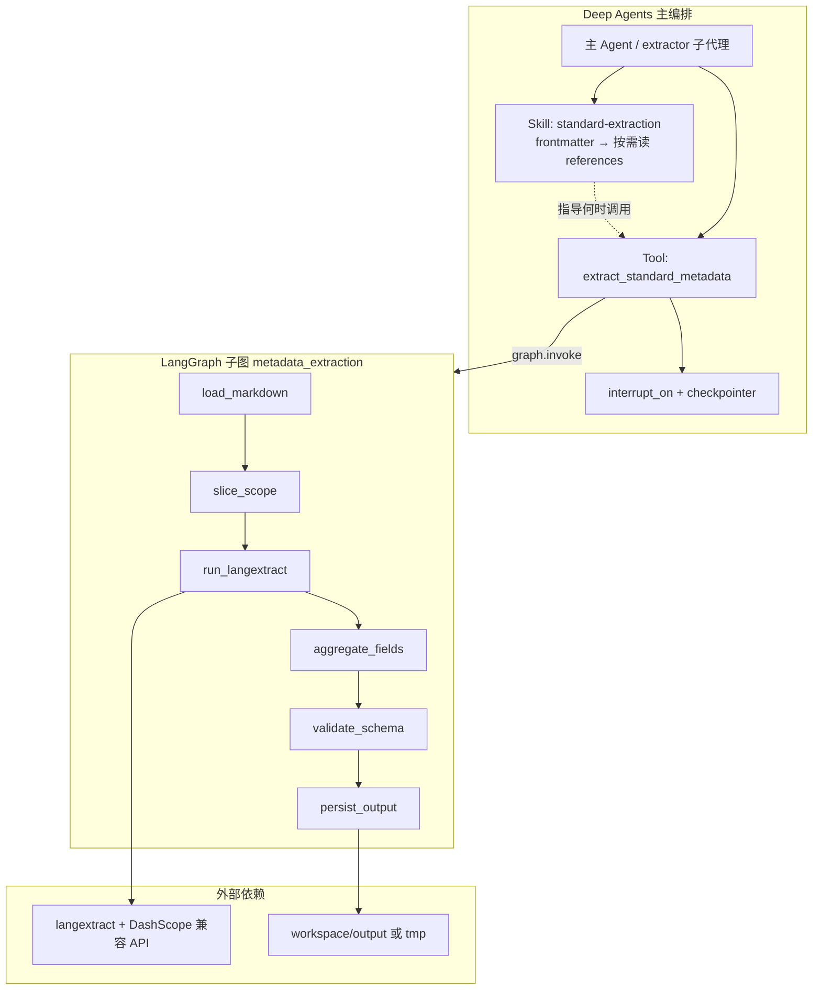
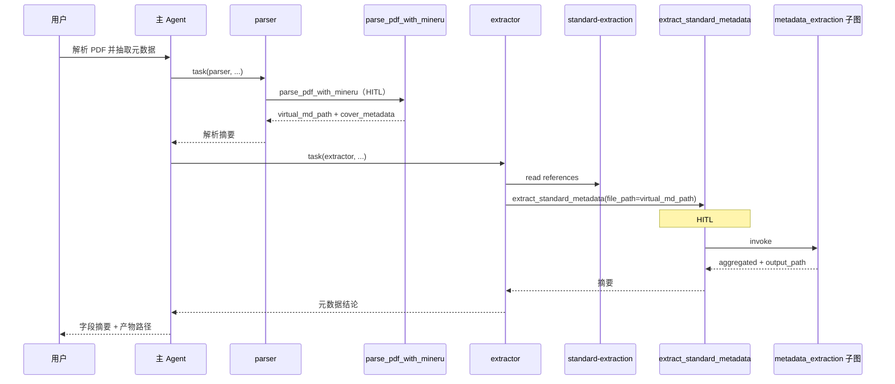

# 国标元数据抽取：LangGraph 子图 + Tool 封装设计方案（方案 A）

> **文档性质**：实施参考设计（不直接改代码）  
> **来源脚本**：`pending_tools/extract_from_md_new.py`  
> **架构选型**：方案 A — LangGraph 确定性子图 + 单一业务 Tool 暴露给 Deep Agents  
> **上游解析**：PDF 版式解析见 `MINERU_PDF_PARSE_TOOL_DESIGN.md`（`parse_pdf_with_mineru`）  
> **官方依据**：  
> - [Deep Agents Skills](https://docs.langchain.com/oss/python/deepagents/skills)（渐进披露）  
> - [Deep Agents Customization](https://docs.langchain.com/oss/python/deepagents/customization)（custom tools、`interrupt_on`）  
> - [LangGraph subgraph checkpointer](https://docs.langchain.com/oss/python/langgraph/add-memory#use-in-subgraphs)  
> - 项目内：`DEEP_AGENT_SPEC_V2.md`、`agent.py`、`tools.py`、`skills/standard-extraction/`

---

## 一、目标与边界

### 1.1 目标

将 `extract_from_md_new.py` 中的**单文件抽取主链路**产品化，纳入标准文档助手 Deep Agent：

1. 用 **LangGraph `StateGraph`** 表达固定流水线（可观测、可单测、可 LangSmith trace）。
2. 用 **一个 custom tool**（`extract_standard_metadata`）对主编排 Agent / `extractor` 子代理暴露能力。
3. 用 **Skills** 承载字段规范、质检规则与「何时调用」的程序性知识（渐进披露）。

### 1.2 非目标（本阶段不做）

| 项 | 说明 |
|----|------|
| `CompiledSubAgent` 委派 | 属方案 B；本方案不增加 `task` 委派层 |
| 批处理 CLI | `ThreadPoolExecutor`、目录扫描、断点跳过保留在 `scripts/` 或 `pending_tools/` |
| PDF 解析实现 | 属解析链路，见 `MINERU_PDF_PARSE_TOOL_DESIGN.md` |
| 子图内多轮 LLM 对话 | 仅 `run_langextract` 节点调用外部模型一次（与现脚本一致） |

### 1.3 与项目工具边界

本设计**仅**定义国标元数据抽取；不再使用已废弃的最小占位工具（`extract_key_information` 等）。

| 能力 | 正式工具 | 说明 |
|------|----------|------|
| PDF → Markdown（版式/OCR） | `parse_pdf_with_mineru` | 见 MinerU 设计文档；产出 `virtual_md_path` |
| 国标 16 字段元数据抽取 | **`extract_standard_metadata`**（本文） | langextract + 子图聚合 |
| 结构化输出校验 | `validate_output_schema` | 校验 `StandardMetadataExtraction` / `AgentResult` |
| 长期记忆提案 | `propose_memory_update` | 与抽取链路无直接依赖 |

**输入前提**：`extract_standard_metadata` 的 `file_path` 通常指向 MinerU 或用户已放入 `/workspace/input` 的 `.md` 文件；不在本 tool 内做 PDF 解析。

---

## 二、总体架构



**分工原则**：

| 层级 | 职责 | 参考 |
|------|------|------|
| **Skill** | 16 字段定义、ICS/CCS 规范、scope 选择、质检清单、失败时如何向用户说明 | [Skills 渐进披露](https://docs.langchain.com/oss/python/deepagents/skills#how-skills-work) |
| **Tool** | 参数校验、调用子图、返回摘要 + 产物路径（不把全文塞进 messages） | [Customization](https://docs.langchain.com/oss/python/deepagents/customization) |
| **LangGraph 子图** | 确定性步骤、错误分类、节点级 trace；经 Tool 调用时继承父级 `RunnableConfig` | [LangGraph StateGraph](https://docs.langchain.com/oss/python/langgraph/overview) |

**LangSmith / Studio（已实现）**：

- `extract_standard_metadata` 通过 `ToolRuntime.config` 将 callbacks/tags 传入 `metadata_extraction` 子图（`tracing.py`），在 LangSmith 中显示为嵌套 run。
- `langgraph.json` 注册独立 graph id `metadata_extraction`，可在 Studio 单独查看子图拓扑。
- 主编排 Studio **图结构**仍只显示 `agent` 节点；子图步骤在 **Trace 树**（展开 `extract_standard_metadata`）中查看，而非主图画布上的子节点。

---

## 三、LangGraph 子图设计

### 3.1 状态模式 `MetadataExtractionState`

子图**不必**包含 `messages`（方案 A 通过 Tool 调用，非 `CompiledSubAgent`）。建议 TypedDict：

```python
class MetadataExtractionState(TypedDict, total=False):
    # 输入
    source_path: str              # 解析后的宿主机路径（tool 层已白名单）
    markdown: str                 # 可选：若调用方已 parse，可直传以跳过读盘
    scope_mode: Literal["metadata", "full"]
    output_basename: str | None   # 可选输出文件名 stem

    # 中间
    scoped_text: str
    langextract_raw: Any          # lx.extract 返回值（可序列化摘要）
    aggregated: dict[str, Any]    # 16 字段 + 标准性质/制修订

    # 输出
    output_path: str
    validation: dict[str, Any]    # validate 节点结果
    errors: list[str]             # 累积非致命告警
    status: Literal["ok", "failed"]
```

**Reducer**：`errors` 使用 `operator.add` 追加；其余字段默认覆盖。

### 3.2 节点定义

| 节点 | 输入 → 输出 | 类型 | 对应现脚本 |
|------|-------------|------|------------|
| `load_markdown` | `source_path` 或已有 `markdown` → `markdown` | 纯 Python | `read_text` |
| `slice_scope` | `markdown` + `scope_mode` → `scoped_text` | 纯 Python | `slice_metadata_scope` |
| `run_langextract` | `scoped_text` → `langextract_raw` | **外部 LLM** | `run_extraction` |
| `aggregate_fields` | `langextract_raw` → `aggregated` | 纯 Python | `build_extraction_result` |
| `validate_schema` | `aggregated` → `validation` | 纯 Python | `StandardMetadataExtraction` |
| `persist_output` | `aggregated` → `output_path` | 写盘 | `*_metadata.json` 写入 |

**边**：线性 `START → load → slice → langextract → aggregate → validate → persist → END`。

**条件路由（P1 可选）**：

- `validate_schema` 若 `valid=False` 且配置 `strict=True` → `END(status=failed)`，否则仍 `persist` 并带 warnings。
- `run_langextract` 超时/429 → 可重试边（最多 2 次，指数退避）。

### 3.3 提示词与示例存放

| 内容 | 位置 | 原因 |
|------|------|------|
| `PROMPT`、`EXAMPLES`、`TARGET_CLASSES` | `graphs/metadata_extraction/prompts.py` 或从 skill references **加载** | 版本化、与 Skill 文档单一来源 |
| Skill 人类可读说明 | `skills/standard-extraction/references/metadata-fields.md` | Agent 按需 `read_file` |
| 运行时 langextract 用的 prompt | 代码加载 `metadata-extraction-prompt.md`（与 skill 同步） | 避免 SKILL.md 与代码漂移 |

### 3.4 编译与调用

```python
# graphs/metadata_extraction/graph.py
def build_metadata_extraction_graph() -> CompiledStateGraph:
    builder = StateGraph(MetadataExtractionState)
    # add nodes & linear edges ...
    return builder.compile()  # 不单独挂 checkpointer；由父图传播（若将来嵌入主图）

_METADATA_GRAPH = None

def get_metadata_extraction_graph() -> CompiledStateGraph:
    global _METADATA_GRAPH
    if _METADATA_GRAPH is None:
        _METADATA_GRAPH = build_metadata_extraction_graph()
    return _METADATA_GRAPH
```

**Checkpointer 说明**（官方）：子图嵌入父图时，仅需父图 compile 时传入 checkpointer，子图会自动传播。方案 A 子图在 **tool 内 `invoke`**，默认**不**要求子图独立 checkpoint；HITL 在 **tool 调用前**由 Deep Agents `interrupt_on` 拦截（见 §五）。

**Trace**：对 `graph.invoke` 包一层 LangSmith `traceable` 或使用父 Agent 同一 `LANGCHAIN_TRACING_V2` 配置，run name 建议 `metadata_extraction_subgraph`。

---

## 四、Tool 封装设计

### 4.1 工具签名

```python
def extract_standard_metadata(
    file_path: str | None = None,
    markdown: str | None = None,
    scope_mode: str = "metadata",
    output_filename: str | None = None,
    write_artifacts: bool = True,
    cover_metadata_hint: dict[str, Any] | None = None,
) -> dict[str, Any]:
    """从国标 Markdown 抽取 16 类元数据字段（ICS、CCS、标准号、提出/归口单位等）。

    使用场景：
    - 上游已完成 PDF/MD 解析（通常为 parse_pdf_with_mineru 产出的 virtual_md_path）；
    - 需要正式结构化元数据 JSON。

    参数：
        file_path: workspace 下 Markdown 路径；与 markdown 二选一。
        markdown: 已解析正文；提供时可跳过读盘。
        scope_mode: metadata（默认，截断至第 4 章前）或 full。
        output_filename: 写入 workspace/output 的文件名（可选）。
        write_artifacts: 是否落盘 JSON。
        cover_metadata_hint: 可选；MinerU 封面元数据，供聚合节点交叉校验（P1）。

    返回：
        status, output_path, virtual_output_path, aggregated_summary, validation, errors
    """
```

### 4.2 Tool 层职责（必须在 Tool 内完成，不依赖 permissions）

| 校验 | 规则 |
|------|------|
| 路径 | 允许 `workspace/input`、`workspace/output/mineru/**`、`workspace/templates`（读）；写入仅 `workspace/output`、`workspace/tmp` |
| 互斥 | `file_path` 与 `markdown` 至少其一 |
| 敏感 | 拒绝 `.env`、`*secret*`、路径穿越 |
| 体积 | `metadata` 模式 scoped_text 上限建议 512KB |

### 4.3 Tool 实现伪代码

```python
def extract_standard_metadata(...) -> dict[str, Any]:
    path = _resolve_input_markdown(file_path, markdown)
    state_in: MetadataExtractionState = {
        "source_path": str(path) if path else "",
        "markdown": markdown or "",
        "scope_mode": scope_mode,
        "output_basename": output_filename,
    }
    graph = get_metadata_extraction_graph()
    result = graph.invoke(state_in)
    if result.get("status") == "failed":
        raise ValueError("; ".join(result.get("errors") or ["metadata extraction failed"]))
    return _public_tool_response(result)
```

### 4.4 注册与 HITL

**业务工具注册（元数据相关）**：

```python
# tools.py — 与解析、审核、起草占位工具解耦后的抽取侧工具
METADATA_TOOLS = [
    extract_standard_metadata,
    validate_output_schema,
]

# 主编排若需全量业务工具，由 agent 模块合并 METADATA_TOOLS、PARSER_TOOLS 等
```

**`agent.py`**：

```python
"interrupt_on": {
    "extract_standard_metadata": True,
    # parse_pdf_with_mineru 见 MinerU 设计文档
},
```

**`build_subagents()` — `extractor`**：

```python
{
    "name": "extractor",
    "tools": [extract_standard_metadata, validate_output_schema],
    "skills": ["/skills/standard-extraction"],
}
```

**`tools.json`**（托管形态同步）：

```json
{
  "name": "extract_standard_metadata",
  "description": "Extract 16 standard metadata fields from Markdown via langextract subgraph."
}
```

```json
"interrupt_config": {
  "extract_standard_metadata": true
}
```

---

## 五、Skills 设计（Deep Agents Skills）

### 5.1 官方模式对齐

Deep Agents Skills 遵循 [Agent Skills 标准](https://docs.langchain.com/oss/python/deepagents/skills#how-skills-work)：

1. 启动时只读各 `SKILL.md` 的 **frontmatter**（`name`、`description`）。
2. 任务匹配后再读正文与 `references/`（**progressive disclosure**）。
3. 自定义子代理**不继承**主 Agent skills，须在 `build_subagents()` 显式绑定。

### 5.2 目录结构（建议）

```text
skills/standard-extraction/
├── SKILL.md
├── references/
│   ├── metadata-fields.md
│   ├── metadata-normalization.md
│   ├── metadata-extraction-prompt.md
│   └── quality-checklist.md
└── scripts/                          # P2 可选
    └── validate_metadata_json.py
```

### 5.3 `SKILL.md` 要点

1. **前置条件**：输入为 Markdown；PDF 须先由 `parse_pdf_with_mineru`（见 `standard-parsing` skill）或用户提供的 `.md`。
2. **调用**：国标正式元数据一律使用 `extract_standard_metadata`；`scope_mode` 默认 `metadata`，封面缺失时用 `full`。
3. **产物**：`/workspace/output/{stem}_metadata.json`；向主 Agent 只回报路径与字段摘要。
4. **不确定**：字段留空字符串，禁止编造。
5. **读取顺序**：`metadata-fields.md` → 按需 `quality-checklist.md`。

### 5.4 Skill 与代码单一来源（P0 约定）

| 资产 | 权威来源 | 消费方 |
|------|----------|--------|
| 字段中文名、是否多值 | `references/metadata-fields.md` | Agent + `run_langextract` prompt |
| ICS/CCS/标准号规则 | `references/metadata-normalization.md` | Agent + langextract |
| Few-shot 示例 | `references/metadata-examples.json` | `langextract_runner.py` |

---

## 六、数据模型（Pydantic）

新增 `schemas.py`：

```python
class StandardMetadataExtraction(BaseModel):
    """国标 16 字段 + 派生字段，对齐 extract_from_md_new 聚合结果。"""

    ics: str = ""
    ccs: str = ""
    标准层级: str = ""
    标准号: str = ""
    代替标准号: str = ""
    发布日期: str = ""
    实施日期: str = ""
    标准中文名称: str = ""
    标准英文名称: str = ""
    采标信息: str = ""
    提出单位: list[str] = Field(default_factory=list)
    归口单位: list[str] = Field(default_factory=list)
    起草单位: list[str] = Field(default_factory=list)
    起草人: list[str] = Field(default_factory=list)
    引用文件: list[str] = Field(default_factory=list)
    专业术语: list[str] = Field(default_factory=list)
    标准性质: str = ""
    制修订: Literal["制订", "修订", ""] = ""
    源文件: str = ""

    model_config = ConfigDict(populate_by_name=True)
```

`validate_schema` 节点：`StandardMetadataExtraction.model_validate(aggregated)`。`validate_output_schema` 工具仍用于主编排最终 `AgentResult`。

---

## 七、代码落点与目录

```text
src/standard_document_assistant/
├── graphs/
│   └── metadata_extraction/
│       ├── state.py
│       ├── nodes.py
│       ├── prompts.py
│       ├── langextract_runner.py
│       └── graph.py
├── tools/
│   └── metadata.py               # extract_standard_metadata（或合并入 tools.py）
├── schemas.py
└── agent.py

skills/standard-extraction/
└── references/ ...

tests/
├── test_metadata_extraction_graph.py
└── test_extract_standard_metadata_tool.py

scripts/
└── batch_extract_metadata.py
```

**依赖**：`langextract` → `[project.optional-dependencies] extraction`。

---

## 八、安全、合规与可观测性

| 项 | 要求 |
|----|------|
| 不伪造 | 聚合层禁止填充 prompt 未出现的字段；空串表示未找到 |
| 外部 LLM | `run_langextract` 使用 `DASHSCOPE_API_KEY`；密钥仅环境变量 |
| HITL | `extract_standard_metadata` 默认 `interrupt_on: true` |
| 上下文 | Tool 返回不含 `scoped_text` 全文；大 JSON 只返回摘要 + `output_path` |
| Trace | 子图 run name `metadata_extraction` |
| 批处理 | 仅 `scripts/batch_extract_metadata.py` |

---

## 九、实施阶段与验收

### P0（最小可用）

| 任务 | 验收 |
|------|------|
| 6 节点子图 + `extract_standard_metadata` | 对 MinerU 产出或样例 md 生成 `*_metadata.json` |
| 迁移 PROMPT/聚合逻辑自 `pending_tools` | golden file 与现脚本一致 |
| 扩展 `standard-extraction` references | extractor 绑定 skill |
| `tools.json`、`interrupt_on`、extractor tools | 仅含抽取相关工具，无旧占位工具 |
| 路径/敏感文件单测 | 非法路径拒绝 |

### P1（生产加固）

| 任务 | 验收 |
|------|------|
| langextract 超时与重试 | 429 可恢复 |
| prompt 从 `references/` 加载 | 改 md 即生效 |
| LangSmith 子图 trace | 6 个 node 有 span |
| `cover_metadata_hint` 与 MinerU 联动 | 标准号等字段一致性提升 |

### P2（扩展）

| 任务 | 验收 |
|------|------|
| `scripts/validate_metadata_json.py` | 离线质检 |
| 条款级抽取子图（若与 16 字段解耦） | 独立 tool，不污染本 subgraph |

---

## 十、与主编排链路的协作序列

解析与抽取均使用**新实现工具**（不再经过旧占位 `parse_document` / `extract_key_information`）。



审核、起草等能力由各自 skill 与后续专用 tool 定义，**不在本文档范围内**。

---

## 十一、风险与对策

| 风险 | 对策 |
|------|------|
| langextract 版本或 API 变更 | 锁定 optional-dep；`langextract_runner` 隔离 |
| 子图在 tool 内 invoke trace 不完整 | `traceable` 包裹 invoke |
| Skill 与 prompt 漂移 | references 单源加载 |
| 上游 MD 质量差 | 依赖 MinerU；skill 要求先完成 `parse_pdf_with_mineru` |
| MinerU 未配置仍调用抽取 | extractor 检查 `virtual_md_path` 存在且为 `.md` |

---

## 十二、参考链接

| 主题 | URL |
|------|-----|
| Deep Agents Skills | https://docs.langchain.com/oss/python/deepagents/skills |
| Deep Agents Customization | https://docs.langchain.com/oss/python/deepagents/customization |
| LangGraph subgraph memory | https://docs.langchain.com/oss/python/langgraph/add-memory#use-in-subgraphs |
| LangSmith trace Deep Agents | https://docs.langchain.com/langsmith/trace-deep-agents |
| MinerU PDF 解析（上游） | `design_docs/MINERU_PDF_PARSE_TOOL_DESIGN.md` |
| 项目 V2 规范 | `design_docs/DEEP_AGENT_SPEC_V2.md` |

---

## 十三、文档变更记录

| 版本 | 日期 | 说明 |
|------|------|------|
| 0.1 | 2026-06-01 | 初稿：方案 A 子图 + Tool + Skills 集成设计 |
| 0.2 | 2026-06-01 | 移除 MCP 方案；删除旧占位工具引用；上游改为 `parse_pdf_with_mineru` |
