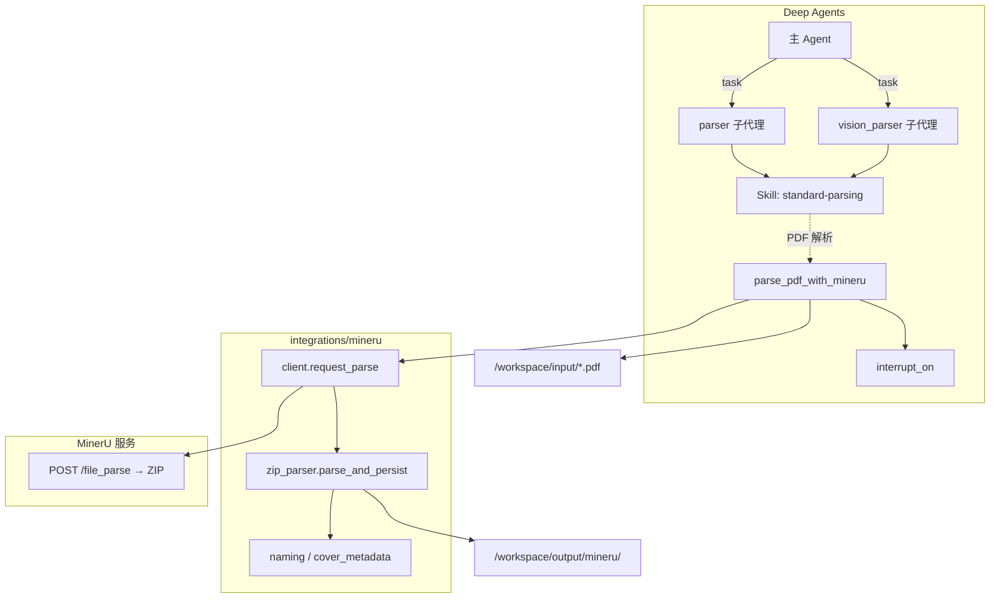
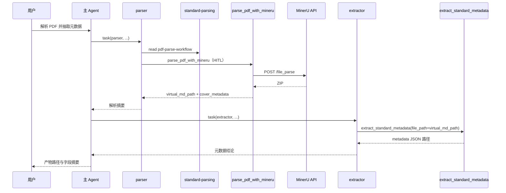

# MinerU PDF 解析：自定义 Tool 设计方案

> **文档性质**：实施参考设计（不直接改代码）  
> **来源脚本**：`pending_tools/minerU2_2.py`  
> **架构选型**：以 **单一 custom tool**（`parse_pdf_with_mineru`）作为标准文档助手 **PDF 解析的正式实现**；逻辑下沉至 `integrations/mineru/`；**P1 可选** LangGraph 子图统一 trace/重试  
> **关联文档**：`METADATA_EXTRACTION_SUBGRAPH_TOOL_DESIGN.md`（下游 `extract_standard_metadata`）、`DEEP_AGENT_SPEC_V2.md`  
> **官方依据**：  
> - [Deep Agents Customization](https://docs.langchain.com/oss/python/deepagents/customization)（custom tools、`interrupt_on`）  
> - [Deep Agents Permissions](https://docs.langchain.com/oss/python/deepagents/permissions)（仅约束内置 VFS，不覆盖 custom tools）  
> - [Deep Agents Skills](https://docs.langchain.com/oss/python/deepagents/skills)（渐进披露）

---

## 一、目标与边界

### 1.1 目标

将 `minerU2_2.py` 中的 **单 PDF 解析主链路** 产品化为标准文档助手的 custom tool，使 Deep Agent 在合规边界内调用 MinerU 服务，获得版式还原的 Markdown 与可选图片产物。

1. 暴露 **一个** 业务工具：`parse_pdf_with_mineru`（**取代** 已废弃的占位工具 `parse_document`、`convert_document_format` 在 PDF 场景下的职责）。
2. 从 `pending_tools/` 抽离可复用库代码（HTTP、ZIP 解析、命名归档），去除硬编码路径与批处理入口。
3. 产物统一落在 `workspace/output/mineru/`（及可选 `workspace/tmp/mineru/`），与虚拟路径 `/workspace/` 对齐。
4. 通过 **Skill** `standard-parsing` 说明 PDF 解析流程、产物路径与失败处理。
5. **HITL**：外部服务调用 + 大量写盘，默认人工审批。
6. 与下游 **`extract_standard_metadata`** 形成「解析 → 元数据抽取」链路。

### 1.2 非目标（本阶段不做）

| 项 | 说明 |
|----|------|
| Word / DOCX 解析 | 非 MinerU 范围；另立 tool 或后续迭代，不在本文档 |
| `CompiledSubAgent` 专用子图代理 | 步骤固定，无需 LLM 编排 MinerU |
| 对话 Agent 暴露目录批处理 | `ThreadPoolExecutor`、整库扫描保留在 `scripts/` |
| 修改用户 `workspace/input` 下原始 PDF | 只读输入，写入仅限 output/tmp |
| 恢复旧占位工具 | `parse_document`、`convert_document_format` 等不再纳入工具注册表 |

### 1.3 与项目工具边界

本设计**仅**覆盖 **PDF → Markdown（+ 可选图片）**。已废弃的最小占位工具不再引用。

| 能力 | 正式工具 | 说明 |
|------|----------|------|
| PDF 版式 / OCR / 图表解析 | **`parse_pdf_with_mineru`**（本文） | MinerU HTTP + ZIP 后处理 |
| 国标元数据抽取 | `extract_standard_metadata` | 消费 `virtual_md_path`，见元数据设计文档 |
| 用户已提供 Markdown | 无需解析 tool | 直接进入 `extract_standard_metadata` |
| 结构化输出校验 | `validate_output_schema` | 与解析链路无强耦合 |
| 长期记忆提案 | `propose_memory_update` | 独立能力 |

---

## 二、来源脚本能力映射

### 2.1 `minerU2_2.py` 模块划分

| 现模块/函数 | 职责 | 迁入目标 |
|-------------|------|----------|
| `MINERU_REQUEST_OPTIONS`、`_build_request_data` | 请求参数与联动 | `integrations/mineru/config.py` |
| `process_pdf` | HTTP `POST /file_parse`、保存 ZIP | `integrations/mineru/client.py` |
| `_parse_result_zip` | 解 ZIP、MD/图/JSON 落盘 | `integrations/mineru/zip_parser.py` |
| `_extract_cover_metadata` 等 | 封面元信息、命名、分类目录 | `integrations/mineru/naming.py` |
| `__main__` 批处理 | 并发、断点、日志 | `scripts/batch_parse_pdf_mineru.py`（不注册为 Agent tool） |

### 2.2 现脚本与生产环境的差距（实施时必须消除）

| 问题 | 生产要求 |
|------|----------|
| 硬编码 `api_base_url`（如 `192.168.104.117:18001`） | `MINERU_API_BASE_URL` 环境变量 |
| 硬编码 `D:\standards\...` 目录 | `WORKSPACE_ROOT` / `OUTPUT_DIR` 下相对路径 |
| `timeout=10000` 秒 | 可配置 `MINERU_REQUEST_TIMEOUT`（建议默认 600，最大 1800） |
| `print` 日志 | `logging` + 可选结构化字段供 LangSmith |
| 无路径白名单 | 与业务 tool 统一的 input/output 校验辅助函数 |

---

## 三、总体架构



**分工原则**：

| 层级 | 职责 |
|------|------|
| **Tool** | 参数校验、调用 MinerU、落盘、返回摘要（路径 + `cover_metadata`） |
| **Skill** | PDF 解析前置条件、产物目录、失败话术、与元数据抽取的衔接 |
| **integrations/mineru** | 与 Agent 无关的纯 Python 实现，可供 tool 与 batch 脚本共用 |
| **LangGraph 子图（P1）** | 可选；validate → request → parse_zip → finalize，用于 trace/重试 |

---

## 四、自定义 Tool 设计

### 4.1 工具名称与定位

| 属性 | 值 |
|------|-----|
| 名称 | `parse_pdf_with_mineru` |
| 类型 | Deep Agents custom tool |
| 调用方 | 主 Agent（委派）、`parser`、`vision_parser` |
| 不注册给 | `extractor`、`reviewer`、`writer`（避免误用高成本解析） |

### 4.2 函数签名

```python
def parse_pdf_with_mineru(
    file_path: str,
    *,
    return_images: bool = True,
    save_zip_archive: bool = True,
    save_middle_json: bool = False,
    save_content_list: bool = False,
    skip_if_zip_exists: bool = True,
    output_subdir: str | None = None,
) -> dict[str, Any]:
    """Call MinerU to parse a PDF into Markdown (and optional images) under workspace/output/mineru.

    This is the canonical PDF parsing tool for the standard document assistant.
    Use for layout preservation, scanned PDFs, tables, figures, and standard cover blocks.

    Args:
        file_path: Path under workspace/input or project-relative whitelist (.pdf only).
        return_images: Extract and rename images per content_list rules.
        save_zip_archive: Persist server ZIP under output/mineru/zip/ for audit/resume.
        save_middle_json: Optionally save middle_json alongside MD.
        save_content_list: Optionally save content_list JSON.
        skip_if_zip_exists: If True and matching zip exists, skip HTTP and only re-parse ZIP.
        output_subdir: Optional subfolder under output/mineru/.

    Returns:
        status, virtual paths, cover_metadata, warnings, error, duration_ms.
    """
```

### 4.3 返回值契约

Tool 返回 **JSON 可序列化 dict**，禁止包含完整 MD 正文（避免撑爆 context）。

```python
{
    "status": "ok",
    "source_path": "...",
    "virtual_md_path": "/workspace/output/mineru/md/行业标准/GB-T-12345-2026.md",
    "host_md_path": "...",
    "virtual_zip_path": "/workspace/output/mineru/zip/sample.zip",
    "virtual_image_root": "/workspace/output/mineru/images/GB-T-12345-2026/",
    "md_category": "行业标准",
    "cover_metadata": {
        "standard_number": "GB/T 12345-2026",
        "replaced_standard_number": "",
        "ics": "12.300",
        "ccs": "A12",
        "file_code": "GB",
        "hierarchy_or_category": "中华人民共和国国家标准",
        "issuing_organizations": "",
    },
    "warnings": [],
    "error": "",
    "duration_ms": 120340,
    "resumed_from_zip": false,
}
```

**虚拟路径**：`STANDARD_DOC_ENABLE_WORKSPACE_BACKEND=1` 时，Agent 用 `/workspace/output/mineru/...` 配合内置 `read_file`；否则在返回中说明 `host_*` 限制。

### 4.4 内部执行流程

```text
1. validate_input(file_path)     → .pdf、大小、白名单、非敏感
2. resolve_output_dirs(...)      → output/mineru/{zip,images,md,json}
3. skip_if_zip_exists ? parse_zip_only : post_file_parse → zip bytes
4. zip_parser.parse_and_persist    → 分类目录、图片重命名、MD 引用、封面前置
5. build_tool_response             → 摘要，无 MD 全文
```

### 4.5 输入类型与下游衔接

| 输入 | 处理方式 |
|------|----------|
| `/workspace/input/*.pdf` | 调用本 tool（HITL） |
| 已是 `/workspace/output/mineru/**/*.md` | 不再解析；直接 `extract_standard_metadata` |
| Word / DOCX | 不在本 tool 范围；skill 中说明需用户先转为 PDF 或提供 MD（P2 可另增 tool） |

**禁止**：在其它 tool 内隐式调用 MinerU（避免绕过 HITL 与路径校验）。

---

## 五、安全、权限与 HITL

### 5.1 custom tool 自行校验（不依赖 `FilesystemPermission`）

| 校验项 | 规则 |
|--------|------|
| 读路径 | `INPUT_DIR`、`TEMPLATES_DIR`（只读）；禁止路径穿越 |
| 写路径 | 仅 `OUTPUT_DIR/mineru`、`TMP_DIR/mineru` |
| 敏感文件 | 拒绝 `.env`、`*secret*`、`*credential*` |
| 文件大小 | `MAX_PDF_SIZE_BYTES`（默认 100MB，可 env 覆盖） |
| 网络 | 仅 `MINERU_API_BASE_URL`（可选 host allowlist） |
| 覆盖策略 | 不修改 `input/` 原 PDF；MD 用 `_allocate_unique_md_path` |

### 5.2 HITL 配置

```python
# agent.py
"interrupt_on": {
    "parse_pdf_with_mineru": True,
}
```

**`tools.json`**（移除旧占位解析/转换工具后，解析侧示例）：

```json
{
  "name": "parse_pdf_with_mineru",
  "description": "Parse a PDF via MinerU into Markdown and optional images under workspace/output/mineru. Requires MinerU service and human approval."
}
```

```json
"interrupt_config": {
  "parse_pdf_with_mineru": true
}
```

### 5.3 环境变量

| 变量 | 必填 | 说明 |
|------|------|------|
| `MINERU_API_BASE_URL` | 是（调用时） | 如 `http://127.0.0.1:18001` |
| `MINERU_REQUEST_TIMEOUT` | 否 | 秒，默认 `600` |
| `MINERU_MAX_PDF_SIZE_MB` | 否 | 默认 `100` |
| `MINERU_REQUEST_OPTIONS_JSON` | 否 | 覆盖 `backend`、`lang_list` 等 |

---

## 六、Skills 设计

### 6.1 `skills/standard-parsing/`

```text
skills/standard-parsing/
├── SKILL.md
└── references/
    ├── pdf-parse-workflow.md    # 仅 parse_pdf_with_mineru；与元数据抽取衔接
    ├── mineru-output-layout.md
    └── mineru-failures.md
```

**`SKILL.md` frontmatter 示例**：

```yaml
---
name: standard-parsing
description: 当用户上传 PDF 标准文档、需要版式还原或扫描件 OCR 解析为 Markdown 时使用；说明 MinerU 解析流程与产物路径。
---
```

**Instructions 要点**：

1. **PDF 标准文档**：使用 `parse_pdf_with_mineru`（调用前说明耗时、依赖 MinerU 服务、需审批）。
2. 成功后只回报 `virtual_md_path`、`cover_metadata` 摘要，不粘贴 MD 全文。
3. 需要 16 字段元数据时，委派 `extractor` 调用 `extract_standard_metadata`（传入 `virtual_md_path`，可选 `cover_metadata_hint`）。
4. 输入已是 Markdown 时，跳过本 tool，直接抽取。
5. `MINERU_API_BASE_URL` 未配置时，明确报错并提示运维配置。

### 6.2 子代理绑定

| 子代理 | `skills` | `tools`（解析） |
|--------|----------|-----------------|
| `parser` | `["/skills/standard-parsing"]` | **`parse_pdf_with_mineru`** |
| `vision_parser` | 同上 | **`parse_pdf_with_mineru`** |
| 主 Agent | `skills=["/skills/"]` | 建议不直接挂本 tool，委派 parser |

```python
# tools.py — 解析侧工具分组（示例）
PARSER_TOOLS = [
    parse_pdf_with_mineru,
]
```

更新 `prompts.py`：`PARSER_PROMPT`、`VISION_PARSER_PROMPT` 指向 MinerU tool，删除对占位解析能力的描述。

同步 `subagents/parser/AGENTS.md`、`subagents/vision_parser/AGENTS.md`。

---

## 七、产物目录规范

```text
workspace/output/mineru/
├── zip/
├── md/
│   ├── 国家标准/
│   ├── 行业标准/
│   ├── 地方标准/
│   └── 其他/
├── images/
└── json/
```

**虚拟路径示例**：`/workspace/output/mineru/md/行业标准/GB-T-12345-2026.md`

批处理日志：`workspace/output/mineru/batch_results.jsonl`（仅 `scripts/batch_parse_pdf_mineru.py`）。

---

## 八、代码落点与依赖

### 8.1 目录结构

```text
src/standard_document_assistant/
├── integrations/mineru/
│   ├── config.py
│   ├── client.py
│   ├── zip_parser.py
│   ├── naming.py
│   └── types.py
├── tools/
│   └── parser.py                 # parse_pdf_with_mineru
├── schemas.py                    # MinerUParseResult（可选）
└── agent.py

scripts/batch_parse_pdf_mineru.py
tests/test_mineru_*.py
```

### 8.2 依赖

```toml
[project.optional-dependencies]
mineru = ["requests>=2.31.0"]
```

### 8.3 注册清单

- **`tools.json`**：以 `parse_pdf_with_mineru` 作为 **唯一 PDF 解析** 业务 tool 条目；删除 `parse_document`、`convert_document_format`。
- **主编排 `STANDARD_DOCUMENT_TOOLS`**：合并 `PARSER_TOOLS`、`METADATA_TOOLS`、`propose_memory_update` 等分组，**不再**包含已废弃占位工具。
- **Managed Deep Agents**：`tools.json` 与 `agent.py` 子代理工具集保持一致。

---

## 九、P1 可选：LangGraph 子图

| 节点 | 职责 |
|------|------|
| `validate_pdf_input` | 路径、大小、后缀 |
| `request_mineru_or_load_zip` | HTTP 或断点读 zip |
| `parse_result_zip` | `zip_parser` |
| `build_response` | 组装 tool 返回 |

Tool 内：`get_mineru_pdf_graph().invoke(state)`。无项目内 LLM 节点。

---

## 十、端到端链路

与 `METADATA_EXTRACTION_SUBGRAPH_TOOL_DESIGN.md` §十 一致，**仅使用新实现工具**。



---

## 十一、实施阶段与验收

### P0（最小可用）

| 任务 | 验收 |
|------|------|
| `integrations/mineru/*` + `parse_pdf_with_mineru` | `workspace/input` 下单 PDF 产出 MD |
| env + 去除硬编码 URL/盘符 | 无内网 IP、无 `D:\standards` 写死在库内 |
| `tools.json` / `agent.py` | 仅新解析 tool；无 `parse_document` / `convert_document_format` |
| `parser` / `vision_parser` + `standard-parsing` | 委派链路可跑通 |
| 路径/大小/敏感文件单测 | 非法路径拒绝 |

### P1（生产加固）

| 任务 | 验收 |
|------|------|
| `skip_if_zip_exists` | 二次调用不重复 POST |
| HTTP 超时与重试 | 5xx / 连接错误可恢复或明确失败 |
| LangGraph 子图（可选） | LangSmith 4 节点 |
| `cover_metadata` → `extract_standard_metadata` hint | 字段一致性提升 |

### P2（批处理与异步）

| 任务 | 验收 |
|------|------|
| `batch_parse_pdf_mineru.py` | 并发、jsonl 日志 |
| Async subagent 多 PDF | 主 Agent 不阻塞 |

---

## 十二、风险与对策

| 风险 | 对策 |
|------|------|
| MinerU 不可用 | `status=failed`；不伪造 MD |
| 超长耗时 | 调大 Server 超时；P2 async；批处理走脚本 |
| context 膨胀 | 只返回路径；`read_file` 按需读 |
| 与元数据封面重复 | P1 `cover_metadata_hint` |
| 主 Agent 误调 | 仅 parser/vision_parser 注册 |
| 用户提交 Word | skill 说明限制；P2 另增转换 tool |

---

## 十三、配置与文档同步清单

| 文件 | 变更 |
|------|------|
| `tools.py` / `tools/parser.py` | 新增 `parse_pdf_with_mineru`；移除占位解析/转换函数注册 |
| `agent.py` | `interrupt_on`、subagents；`PARSER_TOOLS` |
| `tools.json` | 删除旧条目；新增 `parse_pdf_with_mineru` |
| `pyproject.toml` | `[mineru]` optional-deps |
| `.env.example` | MinerU 变量 |
| `skills/standard-parsing/` | 新建 |
| `prompts.py` | `PARSER_PROMPT`、`VISION_PARSER_PROMPT` |
| `METADATA_EXTRACTION_SUBGRAPH_TOOL_DESIGN.md` | 上下游已对齐 |
| `DEEP_AGENT_SPEC_V2.md` | 增加本文档索引（建议） |

---

## 十四、参考链接

| 主题 | URL |
|------|-----|
| Deep Agents Customization | https://docs.langchain.com/oss/python/deepagents/customization |
| Deep Agents Permissions | https://docs.langchain.com/oss/python/deepagents/permissions |
| Deep Agents Skills | https://docs.langchain.com/oss/python/deepagents/skills |
| Deep Agents HITL | https://docs.langchain.com/oss/python/deepagents/human-in-the-loop |
| 国标元数据抽取（下游） | `design_docs/METADATA_EXTRACTION_SUBGRAPH_TOOL_DESIGN.md` |
| 项目 V2 规范 | `design_docs/DEEP_AGENT_SPEC_V2.md` |

---

## 十五、文档变更记录

| 版本 | 日期 | 说明 |
|------|------|------|
| 0.1 | 2026-06-01 | 初稿：MinerU 自定义 tool 设计方案 |
| 0.2 | 2026-06-01 | 移除 MCP 方案；`parse_pdf_with_mineru` 为 PDF 解析唯一正式 tool；删除 `parse_document` / `convert_document_format` 及双路径协作说明 |
