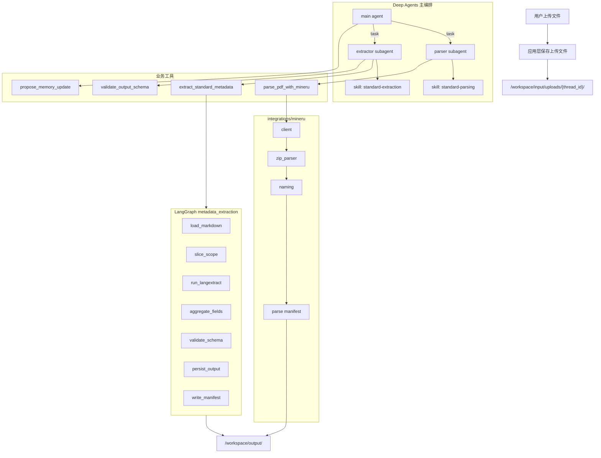
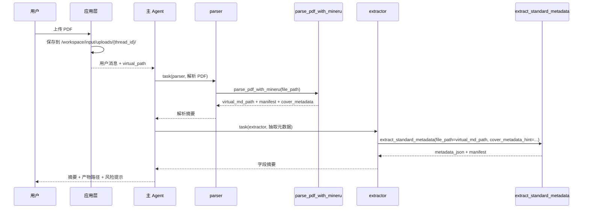

# 标准文档解析与元数据抽取最终实现方案

> 文档性质：最终设计实现方案（本轮仅写设计，不修改业务代码）  
> 适用项目：Deep Agents 标准文档助手  
> 关联一版设计：
> - `design_docs/MINERU_PDF_PARSE_TOOL_DESIGN.md`
> - `design_docs/METADATA_EXTRACTION_SUBGRAPH_TOOL_DESIGN.md`
> - `design_docs/DEEP_AGENT_SPEC_V2.md`

## 1. 结论

最终方案采用 **Deep Agents 顶层编排 + custom tools + LangGraph 确定性子图 + Skills 渐进披露**。

1. 顶层仍使用 Deep Agents，负责对话、规划、文件上下文、Skills、子代理、HITL。
2. PDF 解析实现为单一业务工具 `parse_pdf_with_mineru`，内部封装 MinerU HTTP 调用、ZIP 解析、Markdown/图片/JSON/manifest 落盘。
3. 国标元数据抽取实现为业务工具 `extract_standard_metadata`，内部调用 LangGraph 子图 `metadata_extraction`。
4. 新增上传文件接入层，把用户上传文件保存到 `/workspace/input/uploads/{thread_id}/`，后续工具只使用 Deep Agents 虚拟路径读取。
5. 暂时删除 `vision_parser` 子代理设计，不注册、不暴露、不在提示词中要求使用。
6. 删除原有示例占位工具定义与使用：`parse_document`、`convert_document_format`、`extract_key_information`、`search_reference_documents`、`generate_review_report`、`generate_standard_draft`。
7. 配置采用 **`.env` 存密钥和环境覆盖项，`config.yaml` 存非密钥默认参数**；代码通过统一 `load_config()` 读取，不在工具内散落 `os.getenv()` 和硬编码路径。

官方实践依据：

- Deep Agents customization：`tools`、`skills`、`subagents`、`backend`、`permissions`、`interrupt_on` 均由 `create_deep_agent()` 配置。
- Deep Agents Skills：`SKILL.md` frontmatter 启动时读取，正文和 references 按需加载，适合承载字段规范和工作流说明。
- LangGraph：确定性多节点流水线适合用 `StateGraph` 表达，节点返回 partial update，列表字段用 reducer 累积。

## 2. 最终架构



## 3. 文件上传接入设计

### 3.1 原则

上传文件不是 LLM 生成内容，不应让 Agent 用 `write_file` 手工保存二进制。推荐由应用/API 层在调用 Agent 前完成落盘登记，然后把虚拟路径交给 Agent。

Agent 看到的路径必须是：

```text
/workspace/input/uploads/{thread_id}/{safe_filename}
```

宿主机真实路径由应用层映射到：

```text
workspace/input/uploads/{thread_id}/{safe_filename}
```

### 3.2 新增上传模块

建议新增：

```text
src/standard_document_assistant/
└── uploads.py
```

核心函数：

```python
def save_uploaded_file(
    *,
    original_filename: str,
    content: bytes,
    thread_id: str,
    content_type: str | None = None,
) -> UploadedFileRecord:
    ...
```

职责：

1. 清洗文件名，拒绝路径穿越、盘符、控制字符。
2. 拒绝 `.env`、`*secret*`、`*credential*`。
3. 只允许写入 `workspace/input/uploads/{thread_id}/`。
4. 文件重名时自动追加序号，不覆盖原文件。
5. 计算 `sha256`、大小、后缀、content type。
6. 生成上传登记记录。

返回结构：

```json
{
  "status": "ok",
  "original_filename": "GB-T-12345.pdf",
  "stored_filename": "GB-T-12345.pdf",
  "virtual_path": "/workspace/input/uploads/thread-001/GB-T-12345.pdf",
  "host_path": "D:/deep-agents/workspace/input/uploads/thread-001/GB-T-12345.pdf",
  "suffix": ".pdf",
  "size_bytes": 123456,
  "sha256": "...",
  "created_at": "2026-06-01T..."
}
```

### 3.3 上传 manifest

每个 thread 维护一个上传 manifest：

```text
workspace/input/uploads/{thread_id}/upload_manifest.json
```

内容为 append-only 风格的记录数组，供后续步骤定位用户上传过哪些文件：

```json
{
  "thread_id": "thread-001",
  "files": [
    {
      "virtual_path": "/workspace/input/uploads/thread-001/GB-T-12345.pdf",
      "original_filename": "GB-T-12345.pdf",
      "sha256": "...",
      "size_bytes": 123456,
      "created_at": "..."
    }
  ]
}
```

### 3.4 Agent 调用方式

应用层调用 Agent 时，把上传结果作为用户消息的一部分传入：

```text
已上传文件：
- /workspace/input/uploads/thread-001/GB-T-12345.pdf

请解析该 PDF 并抽取国标元数据。
```

后续 `parse_pdf_with_mineru` 和 `extract_standard_metadata` 只接收虚拟路径，不接收 Windows 盘符路径。

## 4. 路径和产物规范

### 4.1 输入目录

```text
workspace/input/
├── uploads/
│   └── {thread_id}/
├── samples/
└── templates-readonly-link-or-copy/
```

允许读取：

- `/workspace/input/uploads/**`
- `/workspace/input/samples/**`
- `/workspace/templates/**`
- `/workspace/output/mineru/**/*.md`
- `/workspace/output/metadata/**/*.json`

禁止读取：

- `.env`
- `*secret*`
- `*credential*`
- 项目根下任意未白名单路径
- Windows 盘符路径
- `..` 路径穿越

### 4.2 输出目录

```text
workspace/output/
├── mineru/
│   ├── zip/
│   ├── md/
│   │   ├── 国家标准/
│   │   ├── 行业标准/
│   │   ├── 地方标准/
│   │   └── 其他/
│   ├── images/
│   ├── json/
│   └── manifests/
├── metadata/
│   ├── json/
│   └── manifests/
├── reports/
└── drafts/
```

所有业务工具写入只能落在 `/workspace/output/**` 或 `/workspace/tmp/**`。

### 4.3 产物 manifest

每个工具调用必须生成 manifest，避免后续步骤不知道该读哪个文件。

MinerU manifest 示例：

```json
{
  "tool": "parse_pdf_with_mineru",
  "status": "ok",
  "source_virtual_path": "/workspace/input/uploads/thread-001/GB-T-12345.pdf",
  "primary_artifact": {
    "type": "markdown",
    "virtual_path": "/workspace/output/mineru/md/国家标准/GB-T-12345-2026.md"
  },
  "artifacts": [
    {
      "type": "markdown",
      "virtual_path": "/workspace/output/mineru/md/国家标准/GB-T-12345-2026.md"
    },
    {
      "type": "zip",
      "virtual_path": "/workspace/output/mineru/zip/GB-T-12345.zip"
    },
    {
      "type": "image_root",
      "virtual_path": "/workspace/output/mineru/images/GB-T-12345-2026/"
    },
    {
      "type": "middle_json",
      "virtual_path": "/workspace/output/mineru/json/middle_GB-T-12345.json"
    }
  ],
  "cover_metadata": {
    "standard_number": "GB/T 12345-2026",
    "ics": "12.300",
    "ccs": "A12"
  },
  "warnings": [],
  "created_at": "..."
}
```

元数据 manifest 示例：

```json
{
  "tool": "extract_standard_metadata",
  "status": "ok",
  "source_virtual_path": "/workspace/output/mineru/md/国家标准/GB-T-12345-2026.md",
  "primary_artifact": {
    "type": "metadata_json",
    "virtual_path": "/workspace/output/metadata/json/GB-T-12345-2026_metadata.json"
  },
  "artifacts": [
    {
      "type": "metadata_json",
      "virtual_path": "/workspace/output/metadata/json/GB-T-12345-2026_metadata.json"
    }
  ],
  "validation": {
    "valid": true,
    "warnings": []
  },
  "created_at": "..."
}
```

主 Agent 和 subagent 最终只向用户报告摘要和 manifest/主产物路径，不粘贴大文本。

## 5. 配置设计

### 5.1 是否从 `.env` 或 `config.yaml` 读取

结论：应该统一从项目根加载，规则如下。

| 配置类型 | 来源 | 示例 |
|---|---|---|
| 密钥、服务地址、部署环境覆盖 | `.env` | `DASHSCOPE_API_KEY`、`MINERU_API_BASE_URL`、`LANGSMITH_API_KEY` |
| 非密钥默认参数 | `config.yaml` | MinerU 超时、最大 PDF 大小、输出目录策略、langextract 模型 |
| CI/生产临时覆盖 | 环境变量优先 | `MINERU_REQUEST_TIMEOUT=900` |

优先级：

```text
显式函数参数 > 环境变量/.env > config.yaml > 代码默认值
```

### 5.2 `config.yaml` 建议结构

```yaml
app:
  name: standard-document-assistant
  default_language: zh-CN

runtime:
  streaming: true
  transport: sse
  require_human_approval: true
  default_thread_prefix: standard-doc

workspace:
  uploads_dir: workspace/input/uploads
  output_dir: workspace/output
  tmp_dir: workspace/tmp
  max_upload_size_mb: 100
  allowed_upload_suffixes:
    - .pdf
    - .md
    - .markdown
    - .txt

mineru:
  request_timeout: 600
  max_pdf_size_mb: 100
  return_images: true
  save_zip_archive: true
  save_middle_json: false
  save_content_list: false
  skip_if_zip_exists: true
  output_subdir: ""
  request_options:
    backend: pipeline
    lang_list: ch
    parse_method: auto

metadata_extraction:
  default_scope_mode: metadata
  scoped_text_max_bytes: 524288
  strict_validation: false
  write_artifacts: true
  model:
    provider: dashscope-compatible
    model: qwen-max
    timeout: 120
    max_retries: 2

models:
  primary:
    provider: qwen
    class: langchain_qwq.ChatQwen
    model: qwen3.7-max
    temperature: 0
    max_tokens: 8000
    timeout: 60
    max_retries: 2
```

暂时删除 `models.vision`，避免误导为已有 `vision_parser` 能力。

### 5.3 `.env.example` 建议

```text
DASHSCOPE_API_KEY=
LANGSMITH_TRACING=true
LANGSMITH_API_KEY=
LANGSMITH_PROJECT=standard-document-assistant

MINERU_API_BASE_URL=http://127.0.0.1:18001
MINERU_REQUEST_TIMEOUT=600
MINERU_MAX_PDF_SIZE_MB=100

STANDARD_DOC_ENABLE_WORKSPACE_BACKEND=1
STANDARD_DOC_ENABLE_LOCAL_SKILLS_BACKEND=1
```

### 5.4 代码配置落点

扩展 `src/standard_document_assistant/config.py`：

```text
AssistantConfig
├── runtime
├── primary_model
├── workspace
├── mineru
└── metadata_extraction
```

业务工具不直接散落读取 `.env`。工具入口调用：

```python
config = load_config()
mineru_config = config.mineru
metadata_config = config.metadata_extraction
```

## 6. 工具设计

### 6.1 `parse_pdf_with_mineru`

定位：标准文档 PDF 解析唯一正式工具。

签名：

```python
def parse_pdf_with_mineru(
    file_path: str,
    *,
    return_images: bool | None = None,
    save_zip_archive: bool | None = None,
    save_middle_json: bool | None = None,
    save_content_list: bool | None = None,
    skip_if_zip_exists: bool | None = None,
    output_subdir: str | None = None,
) -> dict[str, Any]:
    ...
```

参数为 `None` 时从 `config.yaml`/环境变量读取默认值。

输入校验：

1. 只接受 `.pdf`。
2. 只接受 `/workspace/input/uploads/**`、`/workspace/input/samples/**`，或明确白名单路径。
3. 转换虚拟路径到宿主机路径时必须确认位于 `WORKSPACE_ROOT` 内。
4. 文件大小不得超过 `mineru.max_pdf_size_mb`。
5. 拒绝敏感文件名。

输出：

```json
{
  "status": "ok",
  "source_virtual_path": "/workspace/input/uploads/thread-001/a.pdf",
  "virtual_md_path": "/workspace/output/mineru/md/国家标准/GB-T-12345-2026.md",
  "virtual_manifest_path": "/workspace/output/mineru/manifests/GB-T-12345-2026_parse_manifest.json",
  "virtual_zip_path": "/workspace/output/mineru/zip/a.zip",
  "virtual_image_root": "/workspace/output/mineru/images/GB-T-12345-2026/",
  "cover_metadata": {},
  "warnings": [],
  "error": "",
  "duration_ms": 0,
  "resumed_from_zip": false
}
```

内部结构：

```text
src/standard_document_assistant/
├── integrations/mineru/
│   ├── __init__.py
│   ├── config.py
│   ├── client.py
│   ├── zip_parser.py
│   ├── naming.py
│   └── types.py
└── tools/
    └── parser.py
```

从 `pending_tools/minerU2_2.py` 迁移：

- `_build_request_data`
- `process_pdf` 的 HTTP 主体
- `_parse_result_zip`
- `_extract_cover_metadata`
- `_prepend_cover_info_to_md`
- 图片重命名和 Markdown 引用替换逻辑

必须移除：

- 硬编码 `192.168.*`
- 硬编码 `D:\standards\...`
- `print`
- `__main__` 批处理逻辑

批处理保留为脚本：

```text
scripts/batch_parse_pdf_mineru.py
```

不注册给 Agent。

### 6.2 `extract_standard_metadata`

定位：国标 16 字段元数据抽取唯一正式工具。

签名：

```python
def extract_standard_metadata(
    file_path: str | None = None,
    *,
    markdown: str | None = None,
    scope_mode: str | None = None,
    output_filename: str | None = None,
    write_artifacts: bool | None = None,
    cover_metadata_hint: dict[str, Any] | None = None,
) -> dict[str, Any]:
    ...
```

输入：

- `file_path` 推荐使用 `/workspace/output/mineru/**/*.md` 或 `/workspace/input/uploads/**/*.md`
- `markdown` 仅用于测试或应用层已读入文本的场景
- `file_path` 与 `markdown` 至少一个存在

输出：

```json
{
  "status": "ok",
  "source_virtual_path": "/workspace/output/mineru/md/国家标准/GB-T-12345-2026.md",
  "virtual_output_path": "/workspace/output/metadata/json/GB-T-12345-2026_metadata.json",
  "virtual_manifest_path": "/workspace/output/metadata/manifests/GB-T-12345-2026_metadata_manifest.json",
  "aggregated_summary": {
    "标准号": "GB/T 12345-2026",
    "标准中文名称": "...",
    "ics": "12.300",
    "ccs": "A12"
  },
  "validation": {
    "valid": true,
    "warnings": []
  },
  "errors": []
}
```

内部结构：

```text
src/standard_document_assistant/
├── graphs/
│   └── metadata_extraction/
│       ├── __init__.py
│       ├── state.py
│       ├── nodes.py
│       ├── graph.py
│       ├── langextract_runner.py
│       └── prompts.py
└── tools/
    └── metadata.py
```

LangGraph 节点：

```text
START
  -> load_markdown
  -> slice_scope
  -> run_langextract
  -> aggregate_fields
  -> validate_schema
  -> persist_output
  -> write_manifest
  -> END
```

状态：

```python
class MetadataExtractionState(TypedDict, total=False):
    source_path: str
    source_virtual_path: str
    markdown: str
    scope_mode: Literal["metadata", "full"]
    scoped_text: str
    langextract_raw: Any
    aggregated: dict[str, Any]
    output_path: str
    output_virtual_path: str
    manifest_path: str
    manifest_virtual_path: str
    validation: dict[str, Any]
    errors: Annotated[list[str], operator.add]
    warnings: Annotated[list[str], operator.add]
    status: Literal["ok", "failed"]
```

从 `pending_tools/extract_from_md_new.py` 迁移：

- `PROMPT`
- `EXAMPLES`
- `TARGET_CLASSES`
- `slice_metadata_scope`
- `infer_standard_nature`
- `build_extraction_result`
- `build_model`
- `run_extraction`

必须移除：

- 硬编码输入输出目录
- CLI 批处理入口
- 并发批处理逻辑

批处理保留为脚本：

```text
scripts/batch_extract_metadata.py
```

不注册给 Agent。

### 6.3 `validate_output_schema`

继续保留，但扩展 schema：

- `AgentResult`
- `MinerUParseResult`
- `StandardMetadataExtraction`
- `ArtifactManifest`
- `MemoryUpdateProposal`

### 6.4 `propose_memory_update`

继续保留。它不属于本文两个工具链路，但符合项目“记忆更新只提案，不直接写入”的约束。

## 7. 旧工具删除方案

必须删除定义与使用，而不是只从提示词中隐藏。

删除函数：

- `parse_document`
- `convert_document_format`
- `extract_key_information`
- `search_reference_documents`
- `generate_review_report`
- `generate_standard_draft`

更新文件：

| 文件 | 处理 |
|---|---|
| `src/standard_document_assistant/tools.py` | 拆分为 package 或仅作为聚合导出；删除旧函数 |
| `src/standard_document_assistant/agent.py` | 删除旧 imports、subagent tools、interrupt_on |
| `src/standard_document_assistant/prompts.py` | 删除旧解析/转换/检索/报告/草稿工具描述 |
| `tools.json` | 删除旧工具条目，新增正式工具 |
| `scripts/smoke_test.py` | 改为新工具 smoke |
| `tests/test_smoke_tools.py` | 跟随 smoke 改造 |
| `README.md` | 更新工具和工作流 |
| `design_docs/DEEP_AGENT_SPEC.md` | 标注为历史草案或更新，避免继续引用旧工具 |
| `design_docs/DEEP_AGENT_SPEC_V2.md` | 同步最终工具表 |

`tools.json` 最终建议：

```json
{
  "tools": [
    {
      "name": "parse_pdf_with_mineru",
      "description": "Parse an uploaded PDF standard document via MinerU into Markdown, images, JSON sidecars, and a manifest under /workspace/output/mineru."
    },
    {
      "name": "extract_standard_metadata",
      "description": "Extract national/industry standard metadata fields from Markdown using a LangGraph metadata extraction subgraph."
    },
    {
      "name": "validate_output_schema",
      "description": "Validate structured outputs against supported Pydantic schemas."
    },
    {
      "name": "propose_memory_update",
      "description": "Create a human-reviewable memory update proposal without writing memory directly."
    }
  ],
  "interrupt_config": {
    "parse_pdf_with_mineru": true,
    "extract_standard_metadata": true,
    "propose_memory_update": true
  }
}
```

## 8. Agent 和 subagent 设计

### 8.1 主 Agent

主 Agent tools：

```python
STANDARD_DOCUMENT_TOOLS = [
    validate_output_schema,
    propose_memory_update,
]
```

是否把 `parse_pdf_with_mineru` 和 `extract_standard_metadata` 也挂到主 Agent：

- 推荐 P0 不挂，强制通过 `parser`、`extractor` 分工调用。
- 如果实际使用中主 Agent 经常需要直接处理单步任务，可 P1 增加，但 system prompt 必须仍优先委派。

### 8.2 `parser` subagent

```python
{
    "name": "parser",
    "description": "解析用户上传的 PDF 标准文档，调用 MinerU 生成 Markdown、图片、JSON 和 manifest。",
    "system_prompt": PARSER_PROMPT,
    "tools": [parse_pdf_with_mineru],
    "skills": ["/skills/standard-parsing"],
    "interrupt_on": {"parse_pdf_with_mineru": True},
}
```

职责：

1. 只处理 PDF 到 Markdown 的解析。
2. 输入已是 Markdown 时，不调用 MinerU，直接把路径交给 extractor。
3. 返回 `virtual_md_path`、`virtual_manifest_path` 和 `cover_metadata` 摘要。
4. 不做审核结论。

### 8.3 `extractor` subagent

```python
{
    "name": "extractor",
    "description": "从 Markdown 标准文档中抽取国标元数据字段，生成结构化 JSON 和 manifest。",
    "system_prompt": EXTRACTOR_PROMPT,
    "tools": [extract_standard_metadata, validate_output_schema],
    "skills": ["/skills/standard-extraction"],
    "interrupt_on": {"extract_standard_metadata": True},
}
```

职责：

1. 必须使用 `standard-extraction` skill。
2. 必须调用 `extract_standard_metadata`，不再调用 `extract_key_information`。
3. 字段不确定时留空或标注“不确定”，禁止编造。
4. 返回字段摘要、JSON 路径、manifest 路径。

### 8.4 暂不设计 `vision_parser`

当前删除：

- `build_subagents()` 中的 `vision_parser`
- `subagents/vision-parser/AGENTS.md` 的活跃引用
- `VISION_PARSER_PROMPT`
- `config.yaml` 的 `models.vision`

如果未来恢复，应另立设计：

1. 明确视觉模型或 OCR 工具。
2. 明确图片页输入格式。
3. 明确与 MinerU 的边界。

### 8.5 reviewer/writer/research

本文不实现正式审核、起草、检索工具。为了满足“删除占位工具”，短期策略：

- `reviewer` 可以保留 subagent，但只使用 `/skills/standard-review` 和内置文件工具读取已有 Markdown/metadata，报告写入通过 Deep Agents 内置 `write_file`，受 `interrupt_on["write_file"]` 约束。
- `writer` 同理，仅使用 `/skills/standard-drafting` 和内置 `write_file`。
- `research` 暂不挂 `search_reference_documents`；后续单独设计 RAG/retriever 工具。

## 9. Skills 设计

### 9.1 新增 `skills/standard-parsing`

```text
skills/standard-parsing/
├── SKILL.md
└── references/
    ├── pdf-parse-workflow.md
    ├── mineru-output-layout.md
    └── mineru-failures.md
```

`SKILL.md` 要点：

1. 当输入是 PDF 标准文档时，调用 `parse_pdf_with_mineru`。
2. 输入已是 Markdown 时，跳过解析。
3. 解析成功后，向主 Agent 返回 `virtual_md_path`、`virtual_manifest_path`、`cover_metadata`。
4. 不粘贴 Markdown 全文。
5. MinerU 服务未配置或不可达时，明确失败，不伪造解析结果。

### 9.2 扩展 `skills/standard-extraction`

```text
skills/standard-extraction/
├── SKILL.md
└── references/
    ├── metadata-fields.md
    ├── metadata-normalization.md
    ├── metadata-extraction-prompt.md
    ├── metadata-examples.json
    └── quality-checklist.md
```

`SKILL.md` 要点：

1. 输入必须是 Markdown 路径或 Markdown 正文。
2. 对正式元数据抽取必须调用 `extract_standard_metadata`。
3. 默认 `scope_mode=metadata`。
4. 封面信息不足时可使用 `scope_mode=full`。
5. `cover_metadata_hint` 来自 MinerU 时，应传给工具用于交叉校验。
6. 输出只报告字段摘要、JSON 路径、manifest 路径。

### 9.3 prompt 单一来源

元数据字段定义、规范化规则、few-shot 示例必须避免在 skill 和代码中长期双写。

推荐：

- 人类可读说明放在 `skills/standard-extraction/references/*.md`
- 运行时 prompt 从 package 内资源或 skill references 加载
- 添加测试校验关键字段列表一致

P0 可以先复制到 package，P1 改为资源加载；但必须有测试防止漂移。

## 10. Pydantic schema

新增或扩展：

```python
class UploadedFileRecord(BaseModel):
    original_filename: str
    stored_filename: str
    virtual_path: str
    host_path: str
    suffix: str
    size_bytes: int
    sha256: str
    created_at: str


class ArtifactRef(BaseModel):
    type: str
    virtual_path: str
    description: str = ""


class ArtifactManifest(BaseModel):
    tool: str
    status: Literal["ok", "failed"]
    source_virtual_path: str = ""
    primary_artifact: ArtifactRef | None = None
    artifacts: list[ArtifactRef] = Field(default_factory=list)
    warnings: list[str] = Field(default_factory=list)
    error: str = ""
    created_at: str


class MinerUParseResult(BaseModel):
    status: Literal["ok", "failed"]
    source_virtual_path: str
    virtual_md_path: str = ""
    virtual_manifest_path: str = ""
    virtual_zip_path: str = ""
    virtual_image_root: str = ""
    cover_metadata: dict[str, Any] = Field(default_factory=dict)
    warnings: list[str] = Field(default_factory=list)
    error: str = ""
    duration_ms: int = 0
    resumed_from_zip: bool = False


class StandardMetadataExtraction(BaseModel):
    ics: str = ""
    ccs: str = ""
    标准层级: str = ""
    标准号: str = ""
    代替标准号: str = ""
    发布日期: str = ""
    实施日期: str = ""
    标准中文名称: str = ""
    标准英文名称: str = ""
    采标信息: str = ""
    提出单位: list[str] = Field(default_factory=list)
    归口单位: list[str] = Field(default_factory=list)
    起草单位: list[str] = Field(default_factory=list)
    起草人: list[str] = Field(default_factory=list)
    引用文件: list[str] = Field(default_factory=list)
    专业术语: list[str] = Field(default_factory=list)
    标准性质: str = ""
    制修订: Literal["制订", "修订", ""] = ""
    源文件: str = ""
```

## 11. 安全和 HITL

### 11.1 Deep Agents permissions

保留内置文件工具 permissions：

- `/workspace/input/**` 只读
- `/workspace/templates/**` 只读
- `/workspace/output/**` 读写
- `/workspace/tmp/**` 读写
- `/skills/**` 只读
- `/memories/**` 只读
- `.env`、secret、credential deny

### 11.2 custom tool 自行防护

`parse_pdf_with_mineru`、`extract_standard_metadata` 必须重复做路径安全校验，因为 custom tool 直接使用 Python 文件系统时不会自动套用 Deep Agents filesystem permissions。

### 11.3 HITL

`agent.py`：

```python
"interrupt_on": {
    "write_file": True,
    "edit_file": True,
    "parse_pdf_with_mineru": True,
    "extract_standard_metadata": True,
    "propose_memory_update": True,
}
```

`parse_pdf_with_mineru` 需要 HITL 的原因：

- 调用外部 MinerU 服务
- 写入多个产物
- 可能耗时较长

`extract_standard_metadata` 需要 HITL 的原因：

- 调用外部模型/langextract
- 写入结构化结果
- 结果会作为后续审核依据

## 12. 端到端使用流程

### 12.1 PDF 上传并抽取元数据



### 12.2 Markdown 上传并抽取元数据

```text
用户上传 .md
  -> 应用层保存到 /workspace/input/uploads/{thread_id}/xxx.md
  -> 主 Agent 跳过 parser
  -> extractor 调用 extract_standard_metadata(file_path=...)
  -> 输出 metadata JSON 和 manifest
```

## 13. 测试方案

### 13.1 单元测试

```text
tests/
├── test_uploads.py
├── test_path_safety.py
├── test_mineru_zip_parser.py
├── test_parse_pdf_with_mineru_tool.py
├── test_metadata_extraction_graph.py
├── test_extract_standard_metadata_tool.py
└── test_agent_registration.py
```

必须覆盖：

1. 上传文件保存到正确目录。
2. 同名上传不覆盖。
3. Windows 盘符、路径穿越、secret 文件被拒绝。
4. `parse_pdf_with_mineru` 能从 `/workspace/input/uploads/**` 读取。
5. MinerU mock ZIP 能产出 Markdown、图片目录、manifest。
6. `extract_standard_metadata` 能从 `/workspace/output/mineru/**/*.md` 读取。
7. 元数据 JSON 和 manifest 写入 `/workspace/output/metadata/**`。
8. `build_subagents()` 不再包含 `vision_parser`。
9. agent/tools 注册表不包含六个旧占位工具。

### 13.2 smoke test

新的 smoke test 不依赖真实 MinerU 服务：

1. 创建 Markdown 上传样例。
2. 调用 `extract_standard_metadata` 的 mock/langextract fake 路径。
3. 校验 metadata JSON 和 manifest 存在。
4. 构建 Agent，校验工具注册表。

真实 MinerU 集成测试用环境变量显式开启：

```text
STANDARD_DOC_RUN_MINERU_INTEGRATION=1
```

未开启时跳过，避免 CI 依赖内网服务。

## 14. 实施阶段

### P0：架构清理和最小可用

1. 新增上传保存模块。
2. 新增正式 tools package。
3. 实现 `parse_pdf_with_mineru`，支持 mock ZIP 单测。
4. 实现 `extract_standard_metadata` + LangGraph 子图。
5. 删除六个占位工具定义与注册。
6. 删除 `vision_parser` 子代理设计和注册。
7. 更新 `tools.json`、`agent.py`、`prompts.py`、skills。
8. 更新 smoke test。

验收：

- 用户上传 PDF 后，能得到 MinerU Markdown manifest。
- 用户上传 Markdown 后，能直接抽取 metadata JSON。
- 所有产物都在 `/workspace/output/**`。
- 无旧占位工具被注册。

### P1：生产加固

1. MinerU HTTP retry、超时分类、服务不可达错误提示。
2. `skip_if_zip_exists` 断点续跑。
3. LangSmith trace：工具调用、MinerU 步骤、metadata 子图节点可观测。
4. prompt 从 references/package resource 单源加载。
5. `cover_metadata_hint` 与 langextract 聚合结果冲突检测。

### P2：扩展能力

1. 批处理脚本。
2. 正式审核工具。
3. 正式起草工具。
4. 正式参考文档 RAG/retriever。
5. 如确有需要，再单独设计 `vision_parser`。

## 15. 风险和处置

| 风险 | 处置 |
|---|---|
| MinerU 服务不可用 | 返回 failed，不伪造 Markdown；提示配置 `MINERU_API_BASE_URL` |
| 上传文件路径混乱 | 应用层统一保存到 `/workspace/input/uploads/{thread_id}/`，Agent 只看虚拟路径 |
| 多产物后续难定位 | 每次工具调用必须写 manifest，并返回 manifest 路径 |
| `.env` 泄漏 | permissions deny + custom tool 二次校验 |
| 旧工具残留导致误调用 | P0 先删注册和 imports，再实现新工具 |
| Skill 与代码 prompt 漂移 | references/package resource 单源化 + 测试 |
| vision_parser 能力误导 | 暂时彻底移除活跃设计，未来单独立项 |

## 16. 最终文件变更清单

建议新增：

```text
src/standard_document_assistant/uploads.py
src/standard_document_assistant/pathing.py
src/standard_document_assistant/tools/__init__.py
src/standard_document_assistant/tools/parser.py
src/standard_document_assistant/tools/metadata.py
src/standard_document_assistant/tools/validation.py
src/standard_document_assistant/integrations/mineru/*
src/standard_document_assistant/graphs/metadata_extraction/*
skills/standard-parsing/*
skills/standard-extraction/references/*
tests/test_uploads.py
tests/test_path_safety.py
tests/test_mineru_zip_parser.py
tests/test_parse_pdf_with_mineru_tool.py
tests/test_metadata_extraction_graph.py
tests/test_extract_standard_metadata_tool.py
tests/test_agent_registration.py
```

建议修改：

```text
src/standard_document_assistant/config.py
src/standard_document_assistant/schemas.py
src/standard_document_assistant/agent.py
src/standard_document_assistant/prompts.py
tools.json
config.yaml
.env.example
pyproject.toml
README.md
scripts/smoke_test.py
tests/test_smoke_tools.py
design_docs/DEEP_AGENT_SPEC_V2.md
```

建议删除或停止活跃引用：

```text
subagents/vision-parser/AGENTS.md
pending_tools/minerU2_2.py       # 迁移完成后删除或归档
pending_tools/extract_from_md_new.py  # 迁移完成后删除或归档
```

旧占位工具从所有注册表、提示词和测试中移除。

